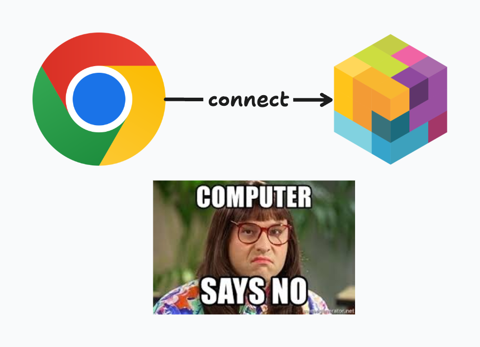
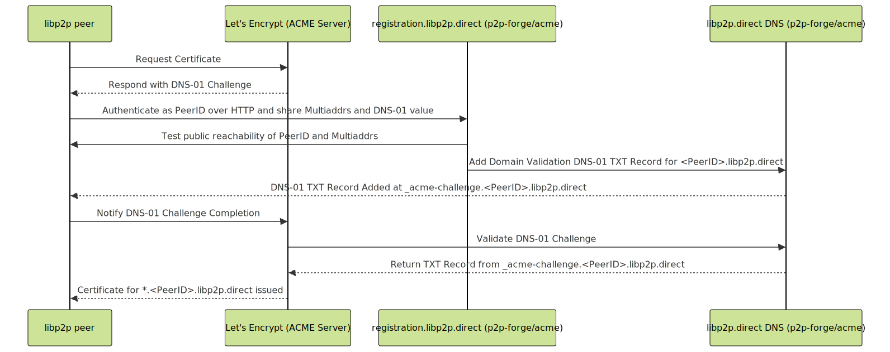
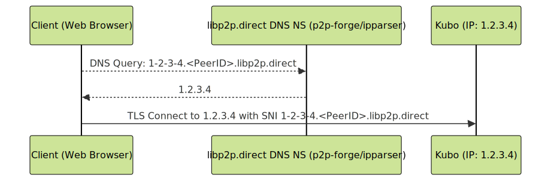

## Announcing AutoTLS: Bridging the Gap Between libp2p and the Web

[Interplanetary Shipyard](https://blog.ipfs.tech/shipyard-hello-world/) is excited to announce AutoTLS, a new service that automates the issuance of Let's Encrypt wildcard TLS certificates for libp2p nodes.

This is a major leap for the libp2p ecosystem, because it allows connectivity between browsers and libp2p nodes using Secure WebSockets, opening up a new class of use cases for libp2p that were previously cumbersome.

This blog post explores the challenges of browser-node connectivity, how AutoTLS works, and how it fits into the libp2p project and the browser ecosystem.

If you're interested in trying it out, we have an example with go-libp2p and js-libp2p:

- [AutoTLS example for go-libp2p](https://github.com/libp2p/go-libp2p/tree/master/examples/autotls)
- [AutoTLS example for js-libp2p](https://github.com/libp2p/js-libp2p-example-auto-tls)

## Why is browser-node connectivity hard?

Historically, the Web relied solely on HTTP, which is unencrypted, undermining user privacy and exposing users to MITM attacks. With the advent of TLS, HTTPS, and automated certificate authorities like Let's Encrypt, encryption is now the norm. So much so that [Chrome warns users "Not secure"](https://blog.google/products/chrome/milestone-chrome-security-marking-http-not-secure/) when they're visiting a site over an unencrypted HTTP connection.

In libp2p, [all connections are encrypted](https://docs.libp2p.io/concepts/secure-comm/overview/#overview) by default, using either Noise or TLS.

For as long as libp2p has existed, browser-node connectivity has been a challenge. Up until recently, connecting to libp2p nodes from the browser required configuring a domain names and obtaining a TLS certificate.

Moreover, browsers require HTTPS and WebSocket connections, requires a TLS certificate signed by a certificate authority (CA).

Recent investments in WebTransport and WebRTC have helped to solve this problem, but they have their own drawbacks outlined below.

Experience has shown that WebSockets are still the most common and reliable way to establish a bi-directional streaming connection from a browser. That's not to say that WebSockets are perfect. Most notably, in libp2p, [Secure WebSockets require 6 round trips to establish a connection](https://connectivity.libp2p.io/#websocket?tab=websocket-in-libp2p). By comparison, [WebTransport requires 3 round trips](https://connectivity.libp2p.io/#webtransport?tab=webtransport-in-libp2p), which is why we believe WebTransport is the future of browser-node connectivity.

## How AutoTLS works

With AutoTLS, the end result is:

1. Your libp2p node, identified by a PeerID, has a wild card certificate for `*.<PeerID>.libp2p.direct`.
2. The authoritative DNS server `*.<PeerID>.libp2p.direct` (part of the AutoTLS service) maps DNS names to your libp2p node's IP addresses statelessly.

With that in mind, let's track back how AutoTLS works starting with Let's Encrypt and ACME.

### Let's Encrypt and ACME

Let's Encrypt is a free, automated, and open certificate authority (CA) service. To obtain a certificate, you need to prove that you control the domain name using a protocol called [ACME](https://letsencrypt.org/how-it-works/), which defines a set of challenges that you need to pass to prove that you control the domain name.

For example, to obtain a wildcard certificate for `*.<PeerID>.libp2p.direct`, you need to prove that you control the domain name by setting a TXT record at `_acme-challenge.<PeerID>.libp2p.direct` with a value that matches the ACME challenge.

### AutoTLS components

AutoTLS has two main components:

1. `registration.libp2p.direct`: An ACME DNS-01 challenge broker that authenticates PeerIDs, verifies your node is reachable on the address you provided, and sets the `_acme-challenge.<PeerID>.libp2p.direct` TXT record for the ACME challenge.
2. `libp2p.direct`: Authoritative DNS server that maps DNS names to the libp2p node's IP addresses **statelessly** (without needing to persist any state about the node's IP addresses).

### AutoTLS DNS-01 challenge broker

1. To kick start the AutoTLS process, your libp2p node requests a TLS certificate for `*.<PeerID>.libp2p.direct` from Let's Encrypt. To which Let's Encrypt responds with a challenge to prove it controls that domain.
2. Your libp2p node then calls the AutoTLS DNS-01 challenge broker (`registration.libp2p.direct`) with the ACME challenge token and your libp2p node's multiaddrs.
3. The DNS-01 challenge broker authenticates your PeerID, verifies your network reachability and sets the TXT DNS record for the [ACME challenge](https://letsencrypt.org/docs/challenge-types/#dns-01-challenge) at `_acme-challenge.<PeerID>.libp2p.direct`.
4. Once that TXT DNS record is set, your node notifies Let's Encrypt that the challenge is complete, validates the challenge, and issues a TLS certificate for `*.<PeerID>.libp2p.direct`.

The following diagram illustrates the AutoTLS DNS-01 challenge broker in action:

### AutoTLS DNS server

The second part of the AutoTLS service is the authoritative DNS server for `libp2p.direct`.

It's main role is to map DNS names to the libp2p node's IP addresses statelessly. For example, `1-2-3-4.<peerID>.libp2p.direct` resolves to the A record with the IP `1.2.3.4`.

The trick here is that the IP address is encoded in the DNS name. Dots are substituted with dashes to ensure the TLS certificate remains valid. The benefit of this approach is that whenever a libp2p node's IP address changes, it's resolvable without coordination. This keeps the DNS server stateless and simple to operate while ensuring that even when a libp2p IP address changes, it's resolvable without coordination.

## Bringing it all together

Once a libp2p node has a TLS certificate for `*.<PeerID>.libp2p.direct`, it will typically announce it via the identify protocol and

The multiaddr for a libp2p node with `libp2p.direct` TLS certificate looks like this:

`/ip4/147.75.63.129/tcp/4002/tls/sni/147-75-63-129.k51qzi5uqu5dht5qyglpp8q4qldzx6d094lqdffp5n80zj5u6vfxk7n4pmutoo.libp2p.direct/ws`

This multiaddr can be dialed from any browser with `js-libp2p`. You can see this in action with the[Helia Identify Tool](https://helia-identify.on.fleek.co/?peer-or-maddr=%2Fip4%2F147.75.63.129%2Ftcp%2F4002%2Ftls%2Fsni%2F147-75-63-129.k51qzi5uqu5dht5qyglpp8q4qldzx6d094lqdffp5n80zj5u6vfxk7n4pmutoo.libp2p.direct%2Fws)

<!-- In libp2p, [all connections are encrypted](https://docs.libp2p.io/concepts/secure-comm/overview/#overview) by default, using either Noise or TLS. -->

### What about other browser transports?

Solving the problem of browser-node connectivity has been a goal for the libp2p project. In recent years, libp2p introduced support for both WebTransport and WebRTC to solve this problem with varying degrees of success.

While these transports have their own strengths and weaknesses, they all share the same goal: enabling browser-node connectivity.

### WebTransport

[Two years ago, the libp2p project bet on the promise of WebTransport](https://blog.libp2p.io/2022-12-19-libp2p-webtransport/) and it's been a bumpy road.

WebTransport has a lot of promise. It's a modern browser protocol based on QUIC (which we already heavily rely on in libp2p), which allows bi-directional streaming communication with many modern improvements over WebSockets. Most notably:

- 3 round trips to establish a connection.
- Support of authentication using certificate hashes eliminates the need for CA-signed certificates and a domain.

However, the WebTransport specification is still in draft, and browsers have a [number of open bugs and issues](https://github.com/libp2p/js-libp2p/issues/2572), that we've been working with the browser vendors to address. As such, browser compatibility breaks as soon as the interoperability target changes.

While we still believe in the longer term promise of WebTransport, we've reoriented our immediate priorities to WebRTC-Direct (which is now available) and Secure WebSockets with AutoTLS. Nonetheless, we continue to work with browser vendors and standard bodies to get WebTransport in libp2p to a stable and interoperable state.

### WebRTC

[WebRTC-Direct](https://github.com/libp2p/specs/blob/master/webrtc/webrtc-direct.md) is an approach using WebRTC to allow browser-to-node communication. It's unique in that it doesn't require SDP signaling, and saves the round trips by constructing the SDP from the information in the webrtc-direct multiaddr (a technique called "SDP munging"). Moreover, WebRTC, doesn't require a domain name and CA-signed TLS certificate.

However, there are a number drawbacks to WebRTC:

- WebRTC is not supported in [Service Workers](https://developer.mozilla.org/en-US/docs/Web/API/Service_Worker_API).
- [Chrome limits the number of WebRTC connections per window to 500](https://issues.chromium.org/issues/41378764) after which it will prevent establishing new connections.
- WebRTC-Direct is relatively complex to implement and is [not yet supported in Node.js with js-libp2p](https://github.com/libp2p/js-libp2p/issues/2581).

## Origins vs. PeerIDs

The Web secuity model is anchored to domain names (origins). Moreover, browsers require TLS certificates to be signed by a certificate authority (CA) so as to ensure that the entity requesting a certificate owns the domain name. The role of certificate authorities is to verify that the entity requesting a certificate owns the domain name.

On the other hand, libp2p's security model is anchored to PeerIDs: unique identifiers derived from public keys generated by the libp2p node. Unlike CA-signed TLS certificates, PeerIDs can permissionlessly be generated.

## Conclusion

Our long-standing goal at [Interplanetary Shipyard](https://blog.ipfs.tech/shipyard-hello-world/) is building a more resilient and participatory internet through decentralization, and we believe that the Web platform plays an important role in this.

AutoTLS is provided as a public good service and operated by [Interplanetary Shipyard](https://ipshipyard.com).

AutoTLS is available in:

- [Kubo starting with v0.32.1](https://github.com/ipfs/kubo/releases/tag/v0.32.1).
- [IPFS Desktop starting with v0.40.0](https://github.com/ipfs/ipfs-desktop/releases/tag/v0.40.0).
- [js-libp2p](https://github.com/libp2p/js-libp2p/tree/main/packages/auto-tls) for Node.js.
- [go-libp2p](https://github.com/libp2p/go-libp2p/tree/master/examples/autotls).

To see code examples of how to use AutoTLS with js-libp2p and go-libp2p, check out the following repositories:

- [go-libp2p](https://github.com/libp2p/go-libp2p/tree/master/examples/autotls)
- [js-libp2p](https://github.com/libp2p/js-libp2p-example-auto-tls)

Try it out and let us know what you think!
