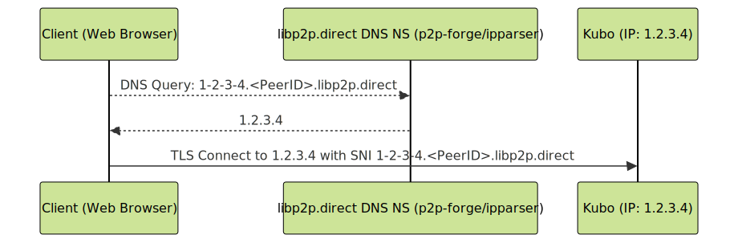

## Announcing AutoTLS: Bridging the Gap Between libp2p and the Web

[Interplanetary Shipyard](https://blog.ipfs.tech/shipyard-hello-world/) is excited to announce [AutoTLS](https://registration.libp2p.direct/), a new service that automates the issuance of Let's Encrypt wildcard TLS certificates for libp2p nodes.

This is a major leap for the libp2p ecosystem, as it allows connectivity between browsers and libp2p nodes using Secure WebSockets, opening up a new class of use cases for libp2p that were previously cumbersome.

This blog post explores the use-cases for AutoTLS, challenges of browser-node connectivity, how AutoTLS works, and how it fits into the libp2p project and the browser ecosystem.

If you're interested in trying it out, we have an example with go-libp2p and js-libp2p:

- [AutoTLS example for go-libp2p](https://github.com/libp2p/go-libp2p/tree/master/examples/autotls)
- [AutoTLS example for js-libp2p](https://github.com/libp2p/js-libp2p-example-auto-tls)

If you prefer a turn-key implementation:

- [IPFS Kubo](https://docs.ipfs.tech/install/command-line/) >= 0.33: Opt-in via [`AutoTLS.Enabled` configuration flag](https://github.com/ipfs/kubo/blob/master/docs/config.md#autotlsenabled)
- [IPFS Desktop](https://docs.ipfs.tech/install/ipfs-desktop/) >= 0.41: enabled by default

## Use-cases for AutoTLS

Browser-node connectivity is foundational to any libp2p based network or application looking to expand its user base, through web-based clients. Since the libp2p ecosystem exhibits a wide range of network topologies, we've identified a few use-cases that benefit from AutoTLS.

The core idea is that AutoTLS enables reliable browser-based clients to connect to libp2p nodes, regardless of the network topology; which improves resilience and opens up a window to more capable browser clients.

Blockchains using libp2p, such as Ethereum, Celestia, and Filecoin, could integrate AutoTLS and improve access to chain state for browser-based [light clients](https://ethereum.org/en/developers/docs/nodes-and-clients/light-clients/#why-are-light-clients-important) and wallets. This would promote client-side transaction and state verification.

Though it remains to be seen how practical browser-based light clients will be, we're already seeing interest in AutoTLS from the community. For example, AutoTLS has already proven to be instrumental for the [Celestia Lumina client implementation](https://github.com/eigerco/lumina), a Rust implementation of Celestia's data availability node, which compiles to WASM. When [running in a browser](https://lumina.rs/), it can reliably connect to more capable bridge and full Celestia nodes with TLS certificates issued by AutoTLS. What's more, the [ProbeLab team](https://probelab.io/) has integrated AutoTLS into [Ants Watch](https://github.com/probe-lab/ants-watch), which monitors the Celestia DHT, and already have [insight into the distribution](https://probelab.io/celestia/dht/2025-02/#lightnode-population) of browser-based Lumina clients in the network.

Another example, which also served as the initial catalyst for AutoTLS, is to enable direct browser retrieval from IPFS nodes, without needing intermediary gateways. The [Service Worker Gateway](https://inbrowser.link) supports discovery and retrieval from AutoTLS-enabled IPFS nodes.

With that in mind, let's explore the challenges of browser-node connectivity.

## Why is browser-node connectivity hard?

Historically, the Web relied solely on unencrypted HTTP as the default transport, undermining user privacy and exposing users to MITM attacks. With the advent of TLS, HTTPS, and automated Certificate Authorities like Let's Encrypt, encryption is now the norm. So much so that [Chrome warns users "Not secure"](https://blog.google/products/chrome/milestone-chrome-security-marking-http-not-secure/) when they're visiting a site over an unencrypted HTTP connection, or produce "mixed-content" errors when a page tries to fetch unencrypted subresources.

In libp2p, [all connections are encrypted](https://docs.libp2p.io/concepts/secure-comm/overview/#overview) by default, using either Noise or TLS.

For as long as libp2p has existed, browser-node connectivity has been a challenge. Browsers do not consider libp2p's encryption layer for WebSocket connections as part of "[Secure Context](https://developer.mozilla.org/en-US/docs/Web/Security/Secure_Contexts)", leaving us with browser-negotiated TLS encryption as the only viable option.

Up until recently, configuring a libp2p node to be connectable from browsers required additional effort, as node operators had to own and manually configure a domain name and obtain a TLS certificate signed by a certificate authority (CA).

Recent investments in [WebTransport](https://connectivity.libp2p.io/#webtransport) and [WebRTC](https://connectivity.libp2p.io/#webrtc) helped circumvent this problem, by removing the need for CA-signed TLS certificate, but they have their own drawbacks outlined below.

Experience has shown that WebSockets are still the most common and reliable way to establish a bidirectional streaming connection from a browser. That's not to say that WebSockets are perfect. Most notably, in libp2p, [Secure WebSockets require 5 round trips to establish a connection](https://connectivity.libp2p.io/#websocket?tab=websocket-in-libp2p), no support for backpressure on streams (except for [`WebSocketStream` in Chrome](https://developer.chrome.com/docs/capabilities/web-apis/websocketstream)), and Secure WebSockets in libp2p require [double encryption](https://github.com/libp2p/specs/pull/625), which is inefficient.

By comparison, [WebTransport requires 3 round trips](https://connectivity.libp2p.io/#webtransport?tab=webtransport-in-libp2p), which is why we believe WebTransport is well positioned to be the recommended transport for browser-node connectivity, alas, only once WebTransport is stable and widely supported by browsers.

## How AutoTLS works

With AutoTLS, the end result is:

1. Your libp2p node, identified by a [PeerID](https://docs.libp2p.io/concepts/fundamentals/peers/#peer-id), has a wild card certificate for `*.<PeerID>.libp2p.direct`.
2. The authoritative DNS server of `libp2p.direct` (part of the AutoTLS service) maps DNS names to your libp2p node's IP addresses statelessly.

> **Note:** `<PeerID>` is [base36 encoded](https://cid.ipfs.tech/#k51qzi5uqu5dh72mdzh50ohq411bo2tzdcdirjw0597vujl9w4hmkn4r8550r0) to keep the DNS label length under 63 characters ([RFC 1034](https://tools.ietf.org/html/rfc1034#page-7)).

With that in mind, let's track back how AutoTLS works starting with Let's Encrypt and ACME.

### Let's Encrypt and ACME

Let's Encrypt is a free, automated, and open certificate authority (CA) service. To obtain a certificate, you need to prove that you control the domain name using a protocol called [ACME](https://letsencrypt.org/how-it-works/), which defines a set of challenges that you need to pass to prove that you control the domain name.

For example, to obtain a wildcard certificate for `*.<PeerID>.libp2p.direct`, you need to prove that you control the domain name by setting a TXT record at `_acme-challenge.<PeerID>.libp2p.direct` with a value that matches the ACME challenge.

### AutoTLS components

AutoTLS has two main components:

1. `registration.libp2p.direct`: An ACME DNS-01 challenge broker that authenticates PeerIDs, verifies your node is reachable on the address you provided, and sets the `_acme-challenge.<PeerID>.libp2p.direct` TXT record for the ACME challenge.
2. `libp2p.direct`: Authoritative DNS server that maps DNS names to the libp2p node's IP addresses **statelessly** (without needing to persist any state about the node's IP addresses).

### AutoTLS DNS-01 challenge broker

1. To kick-start the AutoTLS process, your libp2p node requests a TLS certificate for `*.<PeerID>.libp2p.direct` from Let's Encrypt. To which Let's Encrypt responds with a challenge to prove it controls that domain.
2. Your libp2p node then calls the AutoTLS DNS-01 challenge broker (`registration.libp2p.direct`) with the ACME challenge token and your libp2p node's multiaddrs.
3. The DNS-01 challenge broker authenticates your PeerID, verifies your network reachability and sets the TXT DNS record for the [ACME challenge](https://letsencrypt.org/docs/challenge-types/#dns-01-challenge) at `_acme-challenge.<PeerID>.libp2p.direct`.
4. Once that TXT DNS record is set, your node notifies Let's Encrypt that the challenge is complete, validates the challenge, and issues a TLS certificate for `*.<PeerID>.libp2p.direct`.

The following diagram illustrates the AutoTLS DNS-01 challenge broker in action:

### AutoTLS DNS server

The second part of the AutoTLS service is the authoritative DNS server for `libp2p.direct`.

Its main role is to map DNS names to the libp2p node's IP addresses statelessly. For example, `203-0-113-1.<peerID>.libp2p.direct` resolves to the A record with the IP `203.0.113.1`.

The trick here is that the **IP address is encoded in the DNS name**. Dots are substituted with dashes to ensure the TLS certificate remains valid. The benefit of this approach is that whenever a libp2p node's IP address changes, it's resolvable without coordination. This keeps the DNS server stateless and simple to operate.

## Bringing it all together

Once a libp2p node has a TLS certificate for `*.<PeerID>.libp2p.direct`, it will typically announce a matching Secure WebSocket address via the identify protocol.

The multiaddr for a libp2p node with `libp2p.direct` TLS certificate looks like this (`/p2p/PeerID` suffix omitted for brevity):

`/ip4/145.40.89.101/tcp/4002/tls/sni/145-40-89-101.k51qzi5uqu5dj0wvrbb8keygfyxe2v0fi1qbqz4pl3zzozle7oaqhf97mqazo4.libp2p.direct/ws`

> **Note:** Another valid shorter representation of the multiaddr is `/dns4/145-40-89-101.k51qzi5uqu5dj0wvrbb8keygfyxe2v0fi1qbqz4pl3zzozle7oaqhf97mqazo4.libp2p.direct/tcp/4002/tls/ws`, but it requires a DNS lookup to resolve the IP address. In theory, avoiding the DNS lookup is a performance win, but in practice, browsers don't let you manually set the SNI hostname for a WebSocket connection, so the browser WebSocket API requires the DNS name for the Secure WebSocket connection.

This multiaddr can be dialed from any browser with `js-libp2p`. You can see this in action with the [Helia Identify Tool](https://helia-identify.on.fleek.co/?peer-or-maddr=%2Fdns4%2F145-40-89-101.k51qzi5uqu5dj0wvrbb8keygfyxe2v0fi1qbqz4pl3zzozle7oaqhf97mqazo4.libp2p.direct%2Ftcp%2F4001%2Ftls%2Fws%2Fp2p%2F12D3KooWHVXoJnv2ifmr9K6LWwJPXxkfvzZRHzjiTZMvybeTnwPy)

### What about other browser transports?

Solving the problem of browser-node connectivity has been a goal for the libp2p project. In recent years, libp2p introduced support for both [WebTransport](./webtransport.md) and [WebRTC](./libp2p-webrtc-browser-to-server.md) to solve this problem with varying degrees of success.

While these transports have their own strengths and weaknesses, they all share the same goal: enabling browser-node connectivity.

### WebTransport

[Two years ago, the libp2p project bet on the promise of WebTransport](https://blog.libp2p.io/2022-12-19-libp2p-webtransport/) and it's been a bumpy road.

WebTransport has a lot of promise. It's a modern browser protocol based on QUIC (which we already heavily rely on in libp2p), which allows bidirectional streaming communication with many modern improvements over WebSockets. Most notably:

- 3 round trips to establish a connection.
- Support of authentication using certificate hashes eliminates the need for CA-signed certificates and a domain.

However, the WebTransport specification is still in draft, and browsers have a [number of open bugs and issues](https://github.com/libp2p/js-libp2p/issues/2572), that we've been working with the browser vendors to address. As such, browser compatibility breaks as soon as the interoperability target changes.

While we still believe in the longer term promise of WebTransport, we've reoriented our immediate priorities to WebRTC-Direct (which is now available) and Secure WebSockets with AutoTLS. Nonetheless, we continue to work with browser vendors and standard bodies to get WebTransport in libp2p to a stable and interoperable state.

### WebRTC

[WebRTC-Direct](https://github.com/libp2p/specs/blob/master/webrtc/webrtc-direct.md) is a libp2p approach using WebRTC to allow browser-to-node communication. It's unique in that it doesn't require [SDP](https://en.wikipedia.org/wiki/Session_Description_Protocol) signaling, and saves round trips by constructing the SDP from the information in the webrtc-direct multiaddr (a technique called "SDP munging"). Moreover, WebRTC doesn't require a domain name and CA-signed TLS certificate.

However, there are a number of drawbacks to WebRTC:

- WebRTC is not supported in [Service Workers](https://developer.mozilla.org/en-US/docs/Web/API/Service_Worker_API).
- [Chrome limits the number of WebRTC connections per window to 500](https://issues.chromium.org/issues/41378764) after which it will prevent establishing new connections.

## Origins vs. PeerIDs

The Web security model is anchored to domain names (origins). Moreover, browsers require TLS certificates to be signed by a certificate authority (CA) to ensure that the entity requesting a certificate owns the domain name. The role of certificate authorities is to verify that the entity requesting a certificate owns the domain name.

On the other hand, libp2p's security model is anchored to PeerIDs: unique identifiers derived from public keys generated by the libp2p node. Unlike CA-signed TLS certificates, PeerIDs can permissionlessly be generated.

The AutoTLS broker instance at `libp2p.direct` bridges both worlds while complying with their respective security requirements. The domain was added to https://publicsuffix.org/ and functions as an [eTLD](https://developer.mozilla.org/en-US/docs/Glossary/eTLD), granting each peer its own Origin at `{PeerID}.libp2p.direct`.

The AutoTLS registration API ensures that only the owner of the private key for a PeerID can request a TLS certificate. Beyond that, the API is used quarterly upon certificate renewal. Secrets never leave the end user's machine. And each end user is responsible for the security of their certificates, and revocation is limited to peer-specific subdomains.

## Working towards a better Web platform

A key theme running through this initiative is the challenge of advancing the Web platform to be both more secure and more open. This includes working with browser vendors and [Igalia](https://www.igalia.com/) towards the resolution of various issues with WebTransport, WebRTC, etc.

If you'd like to support our work, please reach out to us at `contact [AT] ipshipyard.com`, and check out the [in-web-browsers](https://github.com/ipfs/in-web-browsers) repository where we're tracking these efforts.

## When _Not_ to use AutoTLS

AutoTLS is designed for production use with Web browsers and should not be used in:

- **Testing/Development**: Unnecessary for local or non-production setups.
- **CI Systems**: Temporary instances waste certificates and may hit rate limits.
- **Non-Public Nodes**: If your node is not publicly dialable (e.g., behind a firewall without port forwarding or UPnP) it won't benefit from `/tls/ws` transport.
- **Private Networks (PNETs)**: AutoTLS is not compatible with libp2p PNET.

## Conclusion

Our long-standing goal at [Interplanetary Shipyard](https://blog.ipfs.tech/shipyard-hello-world/) is building a more resilient and participatory internet through decentralization, and we believe that the Web platform plays an important role in this. We built AutoTLS and run `registration.libp2p.direct` as a public good service for the libp2p ecosystem. Admittedly, it may seem paradoxical that a centralized public good service like AutoTLS could help the Web become more decentralized. But the reality is that AutoTLS is a necessary step to this end, as well as being lean, [open source](https://github.com/ipshipyard/p2p-forge), and built on open standards.

In the long term, WebTransport with self-signed certificates is positioned to become the recommended transport for browser-node connectivity. However, until [WebTransport is production ready](https://github.com/libp2p/js-libp2p/issues/2572), AutoTLS and Secure WebSockets are the best way to enable browser-node connectivity.

AutoTLS is an opt-in feature and can be enabled in:

- [Kubo](https://github.com/ipfs/kubo/releases/tag/v0.33.0) >= 0.33.
- [IPFS Desktop](https://github.com/ipfs/ipfs-desktop/releases/tag/v0.41.0) >= 0.41.
- [Helia](https://github.com/ipfs/helia/releases/tag/helia-v5.2.0) >= 5.2.0.
- [js-libp2p](https://github.com/libp2p/js-libp2p/tree/main/packages/auto-tls) for Node.js.
- [go-libp2p](https://github.com/libp2p/go-libp2p/tree/master/examples/autotls).

To see code examples of how to use AutoTLS with js-libp2p and go-libp2p, check out the following repositories:

- [go-libp2p](https://github.com/libp2p/go-libp2p/tree/master/examples/autotls)
- [js-libp2p](https://github.com/libp2p/js-libp2p-example-auto-tls)

Try it out and let us know what you think!
