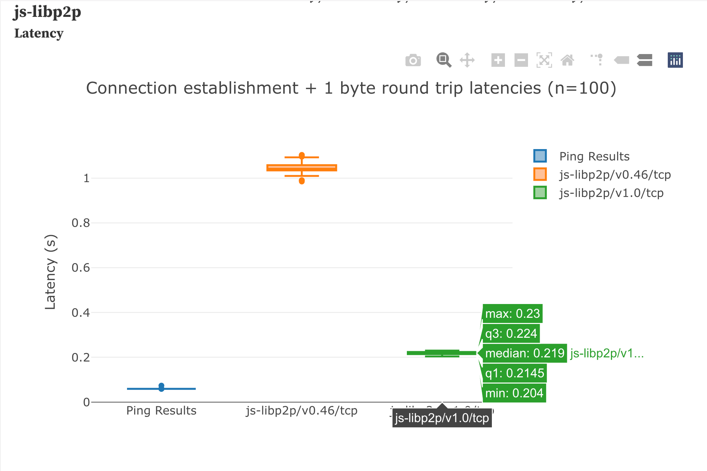
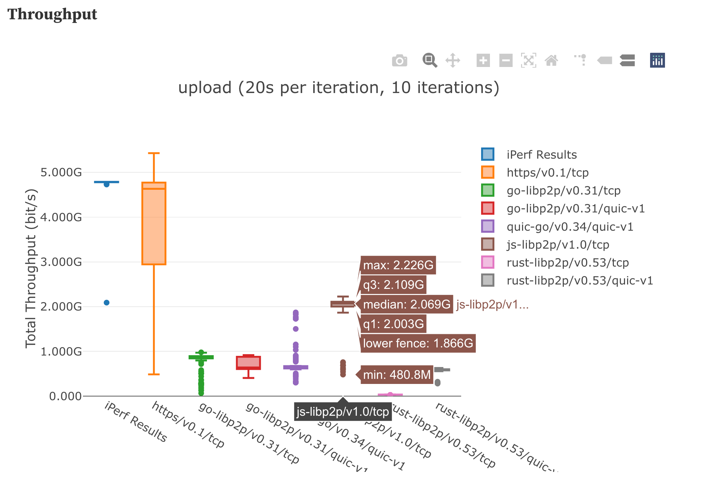

---
tags:
- browser
- transport
- webrtc
- js-libp2p
title: Announcing the release of js-libp2p v1.0.0 🎉
description:
date: 2023-11-22
permalink: "/2023-11-22-js-libp2p/"
translationKey: ''
header_image: ''
author: Chad Nehemiah
---

## Announcing the release of js-libp2p v1.0.0 🎉

js-libp2p has been used in production for many years in IPFS and [Ethereum](https://github.com/ChainSafe/lodestar) along with a [wide variety of other ecosystems](https://github.com/libp2p/js-libp2p/network/dependents). Over the years we have worked tirelessly to improve its functionality based on feedback and insights from real world usage in peer to peer networks. Today, we're excited to announce the release of [js-libp2p v1.0.0](https://github.com/libp2p/js-libp2p/releases/tag/libp2p-v1.0.0) 🎉

# What's new? 🤩

## Smart Dialling

One of the major inefficiencies we recognized was in the dialling of peers; particularly in the browser. Some peers were being dialled on the same address multiple times despite having recent failures, and some peers were being dialled when they were not even online. Dials were also being wasted on peers on unreachable parts of the network, as in the scenario where IPv6 is not supported. This excessive dialling and wasted resources lead us to the development of smart dialling, which is a dialling strategy that is more aware of the network topology and the reachability of the multiaddrs it is dialling. Smart dialling is able to make intelligent decisions about which peers to dial, and when to dial them. This has led to a significant reduction in the number of dials made, and has also led to a significant reduction in the number of failed dials. This has resulted in a much more efficient network, and better peer management.

## Circuit Relay v2

One of the major hurdles in establishing a connection is NAT traversal. Circuit relay was introduced as a means to establish connectivity between libp2p nodes that wouldn't otherwise be able to establish a direct connection to each other. In many cases, peers were be unable to traverse their NAT and/or firewall in a way that made them publicly accessible.

To enable peer-to-peer architectures in the face of connectivity barriers like NAT, libp2p defined a protocol called p2p-circuit. When a peer isn’t able to listen on a public address, it can dial out to a relay peer, which will keep a long-lived connection open. Other peers will be able to dial through the relay peer using a p2p-circuit address, which will forward traffic to its destination.

The circuit relay protocol was inspired by [TURN](https://en.wikipedia.org/wiki/Traversal_Using_Relays_around_NAT?useskin=vector), which is part of the Interactive Connectivity Establishment collection of NAT traversal techniques. Circuit Relay v2 has significant improvements over v1, including:

- Support for resource reservation which allows for more efficient use of relay resources through explicit reservations.
- Limitations placed durations and data caps on relayed connections.
- Introduction of two subprotcols being `hop` and `stop` which were used to reserve and govern these resources effectively.

You can read more about Circuit Relay v2 [here](https://github.com/libp2p/specs/blob/master/relay/circuit-v2.md)

##  NAT Hole punching with DCUtR

As mentioned in Circuit Relay v2, relays are used to traverse NATs by acting as proxies, but this can be expensive to scale and maintain; and may result in low-bandwidth, high-latency connections. Hole punching is another technique that enables NAT traversal by enabling two nodes behind NATs to communicate directly. The libp2p DCUtR (Direct Connection Upgrade through Relay) is a protocol for establishing direct connections between nodes through hole punching, without a signaling server. DCUtR involves synchronizing and opening connections to each peer’s observed external addresses. You can read more about DCUtR [here](https://github.com/libp2p/specs/blob/master/relay/DCUtR.md). Implementing this in js-libp2p has benefitted browser nodes significantly, as it has enabled them to establish direct connections with other nodes without the need for a relay.

## WebRTC Private-to-Private Connectivity

Currently js-libp2p is the only implementation that supports private-to-private browser connectivity using WebRTC. This is a major advantage for js-libp2p, and is a major advantage for the browser ecosystem as allows direct peer-to-peer connecitvity within the browser regardless of whether nodes are located behind NATs / Firewalls. A lot of effort was invested in making this a stable and resource senstive transport that can be reasonably used across browser nodes. For more information, check out the [private-to-private WebRTC spec](https://github.com/libp2p/specs/blob/master/webrtc/webrtc.md).

## WebTransport

Historically, WebSockets were the only way for browsers to establish full-duplex two-way communication with servers. One of the challenges with WebSockets is that they require a TLS certificate signed by a certificate authority tied to a hostname when a page is loaded over HTTPS — something that nodes in peer-to-peer network often don't have.

WebTransport is a new web standard that allows for the creation of bidirectional, multiplexed connections between a client and a server built on top of QUIC. One of the many benefits of WebTransport is support for verification of a TLS certificate hash. This allows establishing WebTransport connections to servers that only have self-signed certificates. The browser trusts the server if the hash of the certificate used during the handshake matches its expected hash.

WebTransport is a major advantage for js-libp2p, and is a major advantage for the browser ecosystem as it allows for the creation of a low-latency, high-bandwidth connection between two peers without relying on certificate authorities. You can read more about WebTransport in the [blog post](https://blog.libp2p.io/2022-12-19-libp2p-webtransport/) and the [spec](https://github.com/libp2p/specs/tree/master/webtransport).

# Performance Improvements and Optimizations 🔧

We've made a variety of performance improvements and optimizations to js-libp2p based on feedback we've received from the community, as well as our performance benchmarking and profiling. We've removed a lot of async operations, fine tuned our streams, reduced round trip times and memory usage. Here's some of the major milestones we've achieved:

## Perf Protocol

The [perf protocol](https://github.com/libp2p/specs/blob/master/perf/perf.md) was created to help us analyze performance libp2p implementations through client-driven benchmarks. This revealed a variety of performance issues, and subsequently, allowed us to make a variety of optimizations. You can read more about the specifics of the test setup [here](https://github.com/libp2p/test-plans/tree/master/perf) but essentially two libp2p nodes are spun up on different AWS servers, and they then send data to each other continously over a period of time. The data is then analyzed to determine the performance of the libp2p implementation, you can view these visualizations on our [performance dashboard](https://observablehq.com/@libp2p-workspace/performance-dashboard). Here are some of the optimizations we made based on the results of the perf protocol:

### Reducing latency
On average 60% improvement in the time it takes to establish a connection between two nodes.

    <figure>
        
        <figcaption style="font-size:x-small;">
            Latency of a connection between the two nodes.
        </figcaption>
    </figure>

### Increasing throughput
We've been continously imnproving the throughput of js-libp2p, and currently js-libp2p has the highest throughput of any libp2p implementations averaging 1.9GB/s on both uploads and downloads!

    <figure>
        
        <figcaption style="font-size:x-small;">
            Throughput of a connection between the two nodes.
        </figcaption>
    </figure>

### Reducing Dependencies

We realized that the libp2p bundle size was unnecessarily big, and that we could reduce the bundle size by removing some of the modules that need not be included for many use cases, such as `fetch` , `UPnP`, `keychain` etc. This reduced the bundle size by over 40%! We still think there is room for even further reduction, and we will be working on this in the future.

## Package Provenance

There is no single answer to the problem of software supply chain integrity. However, there are a variety of techniques that can be used to mitigate the risk of supply chain attacks. One of the techniques we've implemented is package provenance. When you download libp2p from the npm registry you now have visibility into the process by which the source code was translated into the published artifact. You can verify the integrity of provenance attestations via the npm CLI. You can read more about package provenance [here](https://github.blog/2023-04-19-introducing-npm-package-provenance/)

# Developer Experience Improvements 🌈

We realized that there were a variety of pain points in the developer experience, and we wanted to make it as easy as possible to get started with libp2p and begin contributing. Here are some of the improvements we made:

## Monorepo Setup

The js-libp2p ecosystem once consisted of over 81 repositories! This made it the local development experience difficult when debugging many issues that involved multiple modules, and it also made it very difficult to maintain. Upgrading dependencies was a nightmare and our Github notifications were extremely bloated. We decided to consolidate all of the repositories into a single monorepo, and this has made it much easier to contribute to the project, and it has also made it much easier to maintain. There's a single point of entry for all issues, and there's a single point of entry for all pull requests. Dependcies are automatically upgraded in our release cycle and we've standardized our commits and tooling which makes releases seamless.

## Modernization of Tooling

We've completely re-written our codebase in TypeScript, I won't delve into all the benefits of TypeScript here, but suffice to say we've eliminated whole classes of bugs. We've standardized our modules through ESM when packaging our code. We've also ugpraded our logs to be a lot more configurable, adding the ability to append or prefix `peerIds`, more formatting options and the ability to have a custom logger passed in at the component level. We've introduced dependency checking to ensure there are no unused dependencies, more standardized linting and formatting rules as well as PR templates. We're hoping these tools make it faster for developers to iterate.

## Documentation Improvements

This was perhaps one of the biggest hurdles for potential contributors, and it is still an area we are actively improving on. Over the last year we have introduced tools to automate and validate our docs. We introduced a JS-docs based documentation generator which is intended to keep the API docs up to date. We've also introduced a tool which allows us to statically analyze the TS code snippets in our docs to ensure that the code can be copy-pasted and then run. We've added [architectural diagrams](https://github.com/libp2p/js-libp2p/blob/main/doc/ARCHITECTURE.md) which help to explain the various components of js-libp2p, and how they interact. We're hoping these tools make it easier for developers to get started with libp2p, and we're hoping it makes it easier for developers to contribute to libp2p.

# What's next? 🚀

There's still a lot of work left to do, and we're excited to continue working on js-libp2p. Here are some of the things we're working on for the future:

- [React Native Support](https://github.com/libp2p/js-libp2p/issues/2136)
- [QUIC support](https://github.com/libp2p/js-libp2p/issues/1459)
- [Improved documentation](https://github.com/libp2p/js-libp2p/issues?q=is%3Aissue+is%3Aopen+docs)
- [Hosting a js-libp2p bootstrap node](https://github.com/libp2p/js-libp2p-amino-dht-bootstrapper)
- [Improved observability and metrics on js-libp2p nodes](https://github.com/libp2p/js-libp2p/issues/2077)

If any of these things excite you, we'd love to have you hear from you! You can find out more about how to contribute [here](https://github.com/libp2p/js-libp2p/blob/main/CONTRIBUTING.md) as well as the [resources](#resources-and-how-you-can-help-contribute) section below.
Thank you for reading! 🙏

# Resources and how you can help contribute 💪

If you would like to learn more about libp2p, a great place to start is always the [docs](https://docs.libp2p.io/), but we have also included some additional resources below:

* [js-libp2p Discussions](https://github.com/libp2p/js-libp2p/discussions)
  * This is a great place to discuss issues, ideas, and enhancements with the community.
* [Slack / Discord / Matrix](https://filecoinproject.slack.com/archives/C03K82MU486)
  * This is a great place to have real-time discussions with the community.
* [libp2p Specifications](https://github.com/libp2p/specs/)
  * This describes the various libp2p specifications across implementations.