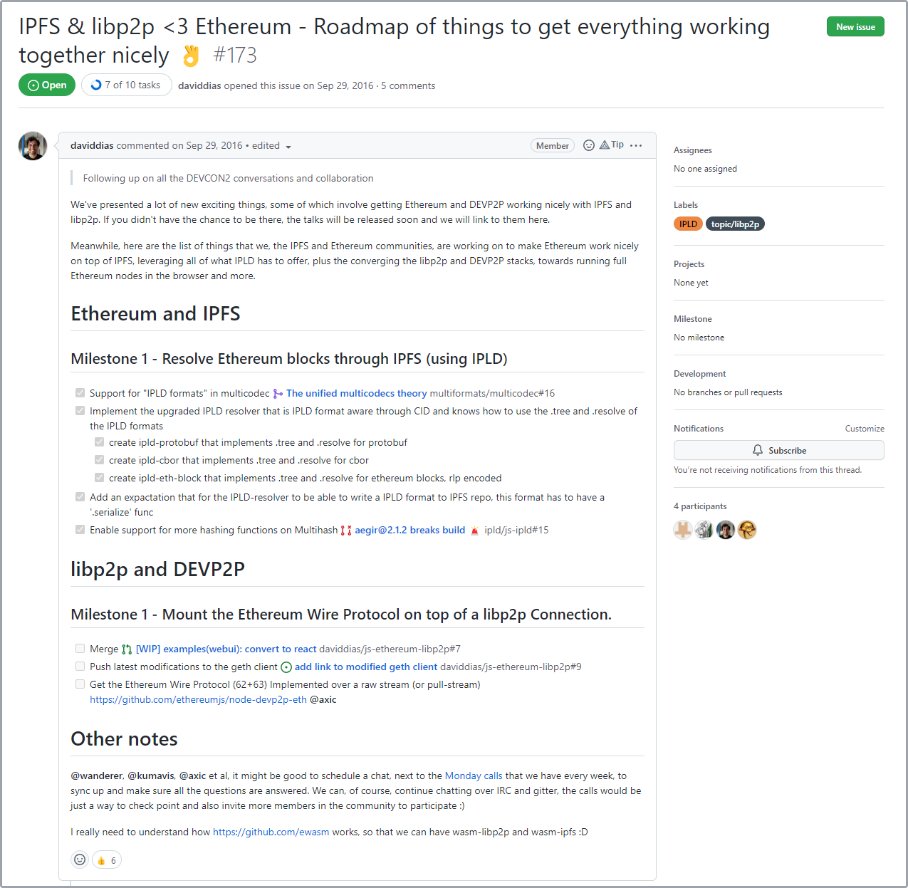
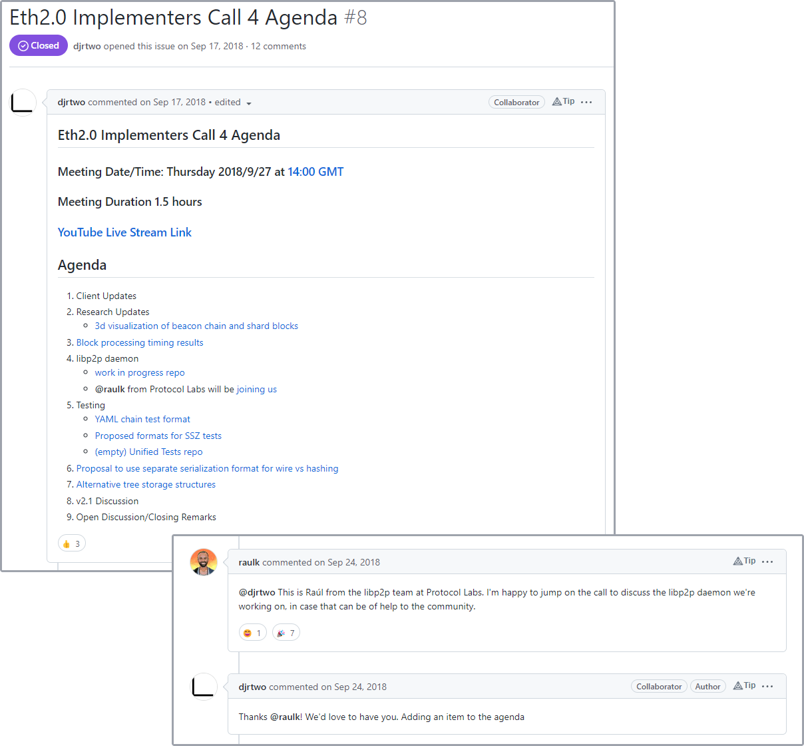
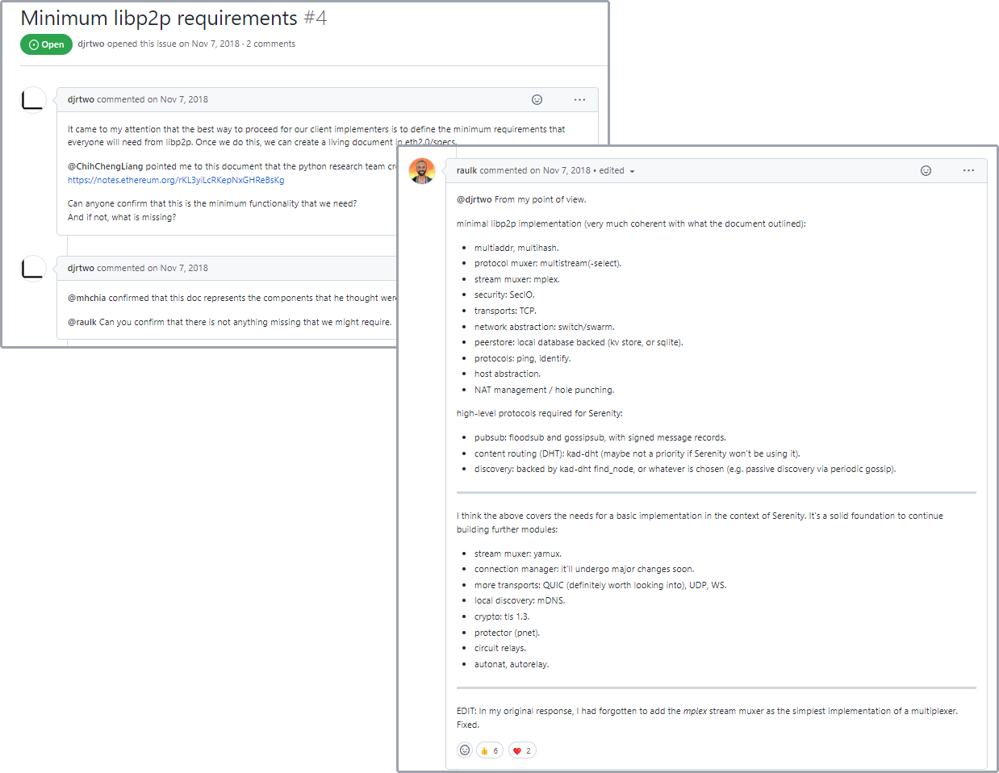
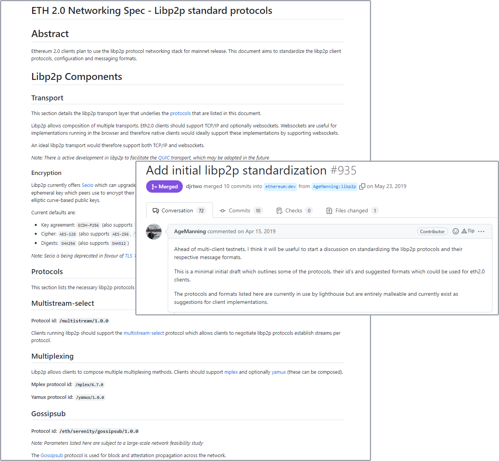
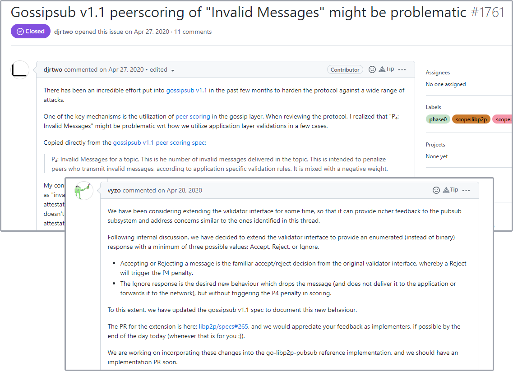
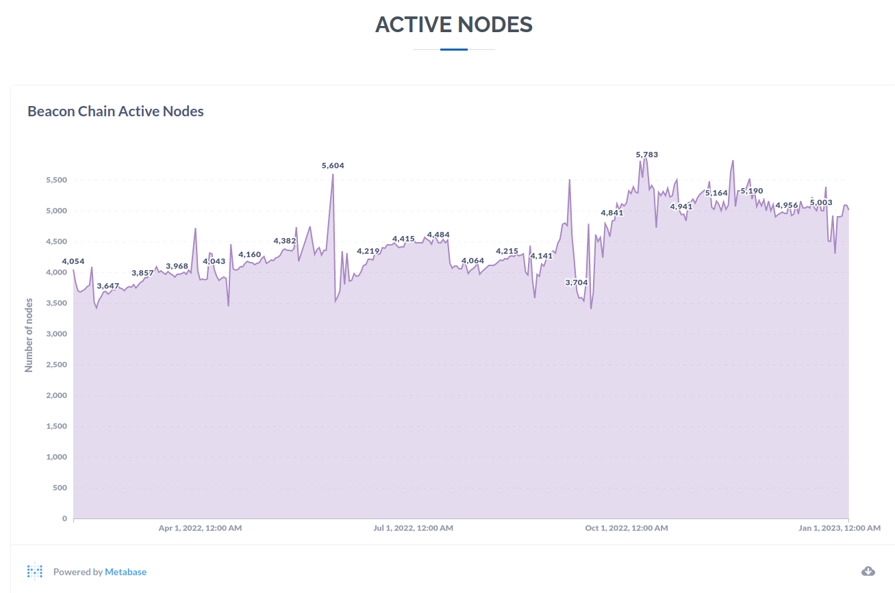

---
tags:
- libp2p
- Ethereum
- Merge
title: libp2p & Ethereum (the Merge)
description:
date: 2023-01-01
permalink: ""
translationKey: ''
header_image: /libp2p_Ethereum_header.png
author: Prithvi Shahi
---

If you've kept up with developments in Web3, you've likely heard of a significant event that occurred a few months ago: the [Paris upgrade](https://github.com/ethereum/execution-specs/blob/master/network-upgrades/mainnet-upgrades/paris.md), more widely known as [The Merge](https://ethereum.org/en/upgrades/merge/), on the [Ethereum network](https://ethereum.org/en/).
This was a historic event for Ethereum and one that was years in the making ([Google even had a countdown](https://decrypt.co/109428/google-counts-down-to-ethereum-merge-with-search-engine-easter-egg) for it.)

You may be wondering... why is the libp2p blog writing about Ethereum and the Merge?
Well, as a result of the Merge, we're excited to share that:
**libp2p is integrated into the Ethereum network! :tada:**

Today we'd like to highlight [years long effort behind this integration](#how-libp2p-was-integrated-into-ethereum), describe [how Ethereum uses libp2p](#how-libp2p-is-used-by-ethereum-validators-🔍), and celebrate this win for Ethereum and libp2p!

---
**Table of Contents:**
[[toc]]

---

## A Brief History of libp2p :hourglass_flowing_sand:

Let's begin with a brief reflection on libp2p's history.

[Protocol Labs](https://protocol.ai/) first developed [libp2p](https://libp2p.io/) as a networking library inside of [IPFS](https://ipfs.tech/).
At the outset, their code and repositories were coupled. However, Protocol Labs soon realized libp2p's potential and utility beyond IPFS and project maintainers split the two codebases apart. This enabled libp2p to truly become a product agnostic, reusable, general purpose networking library.

As a result, the libp2p project saw tremendous growth and adoption across the ecosystem; what started as a humble part of IPFS has come to power much of the decentralized web today.
Besides IPFS and [Filecoin](https://filecoin.io/), libp2p is relied on by networks like [Polkadot](https://wiki.polkadot.network/docs/faq#does-polkadot-use-libp2p), [Polygon](https://wiki.polygon.technology/docs/edge/architecture/modules/networking/), [Mina](https://github.com/MinaProtocol/mina/blob/develop/rfcs/0029-libp2p.md), [Celestia](https://docs.celestia.org/concepts/how-celestia-works/transaction-lifecycle/#checking-data-availability), [Flow](https://github.com/onflow/flow/blob/master/specs/access-node-architecture/index.md#access-node), and many more.

Each network had varying requirements for their networking stack, but by virtue of its [modularity](https://docs.libp2p.io/concepts/introduction/overview/), libp2p provided an appropriate solution. However, _when_ projects chose to integrate libp2p in their lifecycles differed:
Some networks relied on it at genesis, while others adopted it as a part of a network upgrade.

A notable instance of the latter case, and this article's subject, is, of course, the Merge!

What did the Merge upgrade entail? Let's take a look :point_right: 

## The Merge 🐼

Ethereum's genesis occurred on [July 30, 2015](https://etherscan.io/block/0) as a part of a milestone called [Frontier](https://blog.ethereum.org/2015/07/22/frontier-is-coming-what-to-expect-and-how-to-prepare).
Naturally, the network and its protocols evolved via [numerous upgrades](https://ethereum.org/en/history/) after Frontier.
Of those upgrades, the most recent (and arguably the most anticipated) was [Paris](https://github.com/ethereum/execution-specs/blob/master/network-upgrades/mainnet-upgrades/paris.md).

Paris, a.k.a. [The Merge](https://ethereum.org/en/upgrades/merge/), was executed a few months ago [on September 15, 2022](https://etherscan.io/block/15537394).

The Merge encompassed major changes for the Ethereum mainnet. Chief among them were:

1. **Upgrading the [consensus mechanism](https://ethereum.org/en/developers/docs/consensus-mechanisms/)** :rocket:
    * Transitioning to [proof-of-stake](https://ethereum.org/en/developers/docs/consensus-mechanisms/pos/), away from [proof-of-work](https://ethereum.org/en/developers/docs/consensus-mechanisms/pow/) ([EIP-3675](https://eips.ethereum.org/EIPS/eip-3675)).
1. **Reducing network energy consumption by 99.95%** :evergreen_tree: 
1. **Integrating libp2p** into the mainnet's networking layer :handshake:

Upgrading to proof-of-stake was a multi-year effort. It was executed successfully thanks to diligent planning and a strong foundation laid by the Ethereum Foundation and community. As a result, the network [massively reduced its energy footprint](https://ethereum.org/en/energy-consumption) and eliminated mining (performing power-hungry computations to produce blocks) necessitated by proof-of-work.
Many congratulations on this historic accomplishment! :tada:

While we're excited about these accomplishments, the last point is most salient to us. Like the consensus upgrade, the libp2p integration in Ethereum was also a culmination of many years of hard work.

Let's take a closer look at the collaboration between Protocol Labs and the Ethereum community.

## How libp2p was integrated into Ethereum :handshake:
In the early days of Ethereum and libp2p, some commonly asked questions were: "Does Ethereum use libp2p?" or "Why doesn't Ethereum use libp2p?"

Until recently, the answer to the first question was no. The reason for that was the answer to the second question: libp2p didn't exist when Ethereum was first developed, so it never got a chance to be evaluated and/or adopted.

[Felix Lange](https://github.com/fjl), developer of [go-ethereum (Geth)](https://geth.ethereum.org/) at the Ethereum Foundation, reflected on this in an article titled ["Ethereum ♥ libp2p"](https://twurst.com/articles/eth-loves-libp2p.html):

*"libp2p didn't exist when we started building the peer-to-peer networking stack for Ethereum. There were discussions about building something together very early on, but in the end we were more set on shipping a working system than to discussing how to make the most flexible and generic framework."*

Thus, prior to the Merge, Ethereum solely used [devp2p](https://github.com/ethereum/devp2p), a dedicated networking stack and set of networking protocols, not unlike libp2p in some manners.
And though there were talks between the Ethereum and IPFS/libp2p communities to have one solution instead of two, the timing didn't work, and Ethereum shipped with devp2p as its solution.

(To learn more about the differences between devp2p and libp2p, please read the [section at the bottom of the page](#comparing-devp2p-and-libp2p-🤼).)

The desire to integrate libp2p into the network never fizzled out.

Because both of these projects are open-source (hooray!), much of the collaboration happened in public, and we can see how things evolved over the years.

### Early Days (2016-2017) :baby:
[Devcon 2](https://archive.devcon.org/archive/playlists/devcon-2/) was one of the first instances where Protocol Labs presented the possibility of extending Ethereum with libp2p.
There, [David Dias](https://research.protocol.ai/authors/david-dias/) gave a talk on September 2016 titled "[libp2p ❤ devp2p: IPFS and Ethereum Networking](https://archive.devcon.org/archive/watch/2/libp2p-devp2p-ipfs-and-ethereum-networking/?tab=YouTube)".

In this talk David, gave an overview of libp2p and gave a demo. He ran the EVM in a browser and modified a go-ethereum/Geth node to use libp2p. The Geth node running libp2p connected to the Ethereum mainnet, and the EVM nodes in the browsers (also running libp2p) were able to fetch blocks from the Geth node.

At the time, this was a big breakthrough and a sign of things to come.

Following this presentation, Protocol Labs and Ethereum [continued working together](https://github.com/ipfs/notes/issues/173) to see how it would be possible to integrate libp2p.

    <figure>
        
        <figcaption style="font-size:x-small;">
            <a href="https://github.com/ipfs/notes/issues/173">[GitHub Link.]</a>
        </figcaption>
    </figure>

Conversations continued into Devcon 3 in 2017.

There, Felix gave a [talk on devp2p](https://archive.devcon.org/archive/watch/3/evolving-devp2p/?tab=YouTube) which mentioned integration options with libp2p.
Following the event, he published the "[Ethereum ♥ libp2p](https://twurst.com/articles/eth-loves-libp2p.html)" article that expanded on what a libp2p integration could look like:

*"I've been thinking about ways to integrate libp2p for quite a while...My initial goal was to join their DHT, which turned out to be impractical. There's a much easier thing we can do though: use libp2p's transports and multiplexing algorithm. This saves us a bunch of code and gives us a few new protocols...that we can try out without too much work...The ultimate goal is to adopt libp2p's transport protocols as the way Ethereum nodes communicate.*"

This showcased the desire of both communities to leverage the benefits of libp2p.

###  Designing libp2p into the Beacon Chain (2018-2019) :writing_hand:
The above discussions were about integrating libp2p into the Ethereum mainnet, either replacing or augmenting devp2p.

In 2018, the Ethereum community focused significantly on how to scale the network. As the year progressed, the plan became to deliver both scalability and proof-of-stake as a part of "Ethereum 2.0" (for more information, see: [State of the Ethereum Protocol #1](https://media.consensys.net/state-of-ethereum-protocol-1-d3211dd0f6)).
Both solutions were to be developed on a separate chain from the mainnet, called the [Beacon Chain](https://ethereum.org/en/upgrades/beacon-chain/).

At this time, the Ethereum 2.0 community began evaluating the networking requirements for the Beacon Chain. Designing a libp2p integration became a formal effort. Focus moved toward adding libp2p to the Beacon Chain instead of extending/replacing devp2p on the Ethereum mainnet.

[Raul Kripalani](https://twitter.com/raulvk), then the libp2p team lead at Protocol Labs, joined in on many of the [early Eth 2.0 implementers calls](https://github.com/ethereum/eth2.0-pm/issues?q=is%3Aissue+libp2p+is%3Aclosed), advocated for libp2p, and supported the Ethereum community in evaluations and decision-making.

    <figure>
        
        <figcaption style="font-size:x-small;">
            <a href="https://github.com/ethereum/eth2.0-pm/issues/8">[GitHub Link.]</a>
        </figcaption>
    </figure>

As the implementer calls and technical designs progressed, it was decided that the Beacon Chain would use libp2p for networking. The Ethereum community and Protocol Labs drafted initial minimum requirements:

    <figure>
        
        <figcaption style="font-size:x-small;">
            <a href="https://github.com/ethresearch/p2p/issues/4">[GitHub Link.]</a>
        </figcaption>
    </figure>

These efforts culminated in libp2p's formal addition to the Beacon Chain consensus specification in early 2019.

    <figure>
        
        <figcaption style="font-size:x-small;">
            <a href="https://github.com/ethereum/consensus-specs/pull/935">[GitHub Link.]</a>
        </figcaption>
    </figure>

The "initial" standardization shown above was not static, and the networking specification went through many iterations [before](https://github.com/ethereum/consensus-specs/pull/763) and [afterward](https://github.com/ethereum/consensus-specs/pull/1328), with people across the world putting in crazy hours!

<blockquote class="twitter-tweet">
Working in shifts around the clock on this one, 4 continents represented :) <a href="https://t.co/IUEkoXPsrn">https://t.co/IUEkoXPsrn</a> hats off, <a href="https://twitter.com/AgeManning?ref_src=twsrc%5Etfw">@AgeManning</a> <a href="https://twitter.com/raulvk?ref_src=twsrc%5Etfw">@raulvk</a> <a href="https://twitter.com/dannyryan?ref_src=twsrc%5Etfw">@dannyryan</a> / <a href="https://twitter.com/sigp_io?ref_src=twsrc%5Etfw">@sigp_io</a> / <a href="https://twitter.com/ethnimbus?ref_src=twsrc%5Etfw">@ethnimbus</a>
&mdash; Jacek Sieka (@jcksie) <a href="https://twitter.com/jcksie/status/1156969492607590401?ref_src=twsrc%5Etfw">August 1, 2019</a></blockquote> 

Collaboration between these communities and the Beacon Chain's use of libp2p yielded many desirable outcomes.
1. **Several new libp2p implementations:**
    In order to achieve a [high degree of client diversity](https://ethereum.org/en/developers/docs/nodes-and-clients/client-diversity/), numerous clients existed in the Eth 2.0 ecosystem. They consisted of the following:
    - [Prysm](https://docs.prylabs.network/docs/getting-started) (Go)
    - [Lighthouse](https://lighthouse.sigmaprime.io/) (Rust)
    - [Lodestar](https://lodestar.chainsafe.io/) (TypeScript)
    - [Teku](https://docs.teku.consensys.net/en/latest/) (JVM)
    - [Nimbus](https://nimbus.team/) (Nim)
    - [Trinity](https://trinity.ethereum.org/) (Python)
    - [Cortex](https://github.com/NethermindEth/cortex) (.NET)

    libp2p implementations didn't exist for JVM, Python, Nim, and .NET, so clients in those languages had nothing to use. This resulted in the **birth of new libp2p implementations**!
    Protocol Labs and the Ethereum Foundation co-funded some of these implementations: [py-libp2p](https://blog.ethereum.org/2019/02/21/ethereum-foundation-grants-program-wave-5), [nim-libp2p](https://our.status.im/nimbus-team-awarded-grant-for-a-native-implementation-of-libp2p/), [jvm-libp2p](https://blog.web3labs.com/introducing-web3-labs).
1. **New libp2p specifications (and standardization of spec documents):**
    Because libp2p was to be used in the Beacon Chain, the project specifications were given a lot more scrutiny.
    This empowered libp2p maintainers to invest a lot of time into making the specs the best possible.
    One example of this was **adding a new Noise encryption spec**.
    An [open question posited in an early wire protocol draft](https://github.com/ethereum/consensus-specs/issues/692) considered whether to use Noise (not yet standardized in libp2p) in lieu of Secio or TLS 1.3 (both supported in libp2p).
    This created the motivation to [create a spec for and standardize the Noise handshake in libp2p](https://github.com/libp2p/specs/issues/195).
    Many [key developers of Ethereum 2.0 were also formally added](https://github.com/libp2p/specs/issues/232) as interest group members of the Noise spec per the [libp2p spec process](https://github.com/libp2p/specs/blob/master/00-framework-02-document-header.md#authors-and-interest-group).
    Noise was eventually [added as a formal requirement](https://github.com/ethereum/eth2.0-pm/issues/106) of the networking spec, and teams started building new implementations (like [js-libp2p-noise](https://github.com/ethereum/eth2.0-pm/issues/106#issuecomment-558805339).)
2. **Hardening & formalization of existing libp2p implementations:**
    GossipSub was selected for use, resulting in efforts to test it extensively.
    The [Ethereum Foundation and ConsenSys co-funded a grant](https://blog.ethereum.org/2019/08/26/announcing-ethereum-foundation-and-co-funded-grants) to *"analyze the libp2p gossipsub implementation, ...help refine the networking stack and specification, and advance interoperability efforts."*
    This effort was led by [Whiteblock](https://medium.com/whiteblock/ethereum-2-0-networking-grant-update-1-6f988dac4c7b) who published their tests and results as a part of their [gossipsub-tests](https://github.com/Whiteblock/gossipsub-tests) and [p2p-tests](https://github.com/whiteblock/p2p-tests).
    Here's a presentation given by Whiteblock on their efforts at Devcon V: [Networking in ETH2.0](https://archive.devcon.org/archive/watch/5/networking-in-eth20/?tab=YouTube)
    Around this time, Protocol Labs also started to formalize the GossipSub implementation.
1. **libp2p presence at Web3 events and increased community growth:**
    In this period, libp2p technology was in the spotlight by virtue of its use in Eth 2.0.
    - libp2p became the focus of [EthBerlinZwei](https://ethberlinzwei.github.io/KnowledgeBase/resources/libp2p.html) with talks on [GossipSub profiling](https://devpost.com/software/go-libp2p-gossip-berlin), [GossipSub visualization](https://devpost.com/software/libp2p-gossip-pubsub-visualisation), and the [Noise Protocol Framework in libp2p](https://devpost.com/software/go-libp2p-noise-the-new-security-transport-for-eth2-0)

    <blockquote class="twitter-tweet">
August 23-25: EthBerlin Zwei!  Big steps were made during ethberlin for Go-Rust libp2p interop. And I picked up a lot of Go libp2p knowledge quickly thanks to <a href="https://twitter.com/raulvk?ref_src=twsrc%5Etfw">@raulvk</a> <a href="https://t.co/KAvtjcK8lu">pic.twitter.com/KAvtjcK8lu</a>
&mdash; proto.eth (@protolambda) <a href="https://twitter.com/protolambda/status/1599438035594014720?ref_src=twsrc%5Etfw">December 4, 2022</a></blockquote> 

    - Devcon V libp2p presentations on the [libp2p ecoystem](https://archive.devcon.org/archive/watch/5/libp2p-ecosystem-whats-up-and-whats-next/) and [Demystifying GossipSub](https://archive.devcon.org/archive/watch/5/demystifying-libp2p-gossipsub-a-scalable-and-extensible-p2p-gossip-protocol/?tab=YouTube) and at Devcon 4:

    <blockquote class="twitter-tweet">
Excited to see the buzz and vibrant community around <a href="https://twitter.com/libp2p?ref_src=twsrc%5Etfw">@libp2p</a> at <a href="https://twitter.com/hashtag/devcon4?src=hash&amp;ref_src=twsrc%5Etfw">#devcon4</a>. Once started by <a href="https://twitter.com/protocollabs?ref_src=twsrc%5Etfw">@protocollabs</a>, this modular, open P2P networking stack has become an asset and public good for decentralised infrastructure.  Ethereum, let’s <a href="https://twitter.com/hashtag/buidl?src=hash&amp;ref_src=twsrc%5Etfw">#buidl</a> the future of P2P networks together ❤️✌️ <a href="https://t.co/PCaMbJZK3s">pic.twitter.com/PCaMbJZK3s</a>
&mdash; raulvk (@raulvk) <a href="https://twitter.com/raulvk/status/1058712044277510144?ref_src=twsrc%5Etfw">November 3, 2018</a></blockquote> 

    - libp2p talks at the [Web3 Summit](https://www.youtube.com/watch?v=SWdMdN9eGqU), [EthCC 2](https://www.youtube.com/watch?v=yPOROKQRFPQ), and [CrossLink Taipei](https://www.youtube.com/watch?v=B7ecKMtNkXs)
    - A new [libp2p devgrants program](https://github.com/libp2p/devgrants) kicked off at EthBerlinZwei with bounties for projects like [a Lua Wireshark dissector](https://github.com/ethberlinzwei/Bounties/issues/20) and [Noise handshakes in Go](https://github.com/libp2p/devgrants/blob/master/004-noise-handshake-implementations.md)
3. **Analysis of the collaboration:**
    The effort of integrating libp2p in Eth 2.0 also presented a valuable opportunity to reflect on what was going well in the collobration and areas that Protocol Labs could improve on.
    In July 2019, a [study of libp2p and Eth2](https://discuss.libp2p.io/t/report-a-study-of-libp2p-and-eth2/229) was shared.
    The report detailed struggles shared by Ethereum teams in the integration process and provided recommendations on overcoming these issues.

### Full Speed Ahead (2020-present) 🏎️

The Eth 2.0 team started hosting dedicated "networking" meetings (started in Dec 2019) in addition to implementer calls. These meetings were dedicated to [discussing progress and unblocking libp2p-related endeavors](https://github.com/ethereum/eth2.0-pm/issues/124#issuecomment-579740557) (GossipSub paper & peer scoring, Noise, etc.) As before, libp2p core team members were key participants.

#### GossipSub v1.1

Updates to GossipSub and its formalization efforts also made significant headway.
Protocol Labs:
- Introduced [GossipSub v1.1](https://github.com/libp2p/specs/pull/254), which hardened the protocol to prevent a wide range of attacks against it (see this [blog post](https://blog.ipfs.tech/2020-05-20-gossipsub-v1.1/) to learn more).
- Published an [evaluation report of GossipSub v1.1](https://research.protocol.ai/publications/gossipsub-v1.1-evaluation-report/vyzovitis2020.pdf).
- Tested the protocol with a new framework called **[Testground](https://ipfs.io/ipfs/bafybeigyfbsv5rbudh6ufyahfjb4c4fbgayg7cmrrbhnmppni3tdtsg66q/2020-05-06-launching-testground/)** (related article: [Highlights of Testground 2022](https://blog.ipfs.tech/testground-highlights-in-2022/)).

Similarly, the Ethereum 2.0 team:
- Proposed [improvements to the peer scoring functionality](https://github.com/ethereum/consensus-specs/issues/1761).
- Updated the Beacon Chain specifications to [formally require GossipSub v1.1](https://github.com/ethereum/consensus-specs/pull/1796) (after the peer scoring improvements were added)
- Added to the GossipSub [specs](https://github.com/libp2p/specs/pull/294) and [code](https://github.com/libp2p/go-libp2p-pubsub/pull/359) to prevent network splits and avoid privacy problems in Eth 2.0

    <figure>
        
        <figcaption style="font-size:x-small;">
            <a href="https://github.com/ethereum/consensus-specs/issues/1761">[GitHub Link.]</a>
        </figcaption>
    </figure>

<!--  -->

Finally, on December 1, 2020, the Beacon Chain genesis occurred!:
<blockquote class="twitter-tweet">
Congratulations on genesis, <a href="https://twitter.com/hashtag/eth2?src=hash&amp;ref_src=twsrc%5Etfw">#eth2</a>, from your gossipy and streamy cousin libp2p! 🚀  Eth2 has been a driving force in the <a href="https://twitter.com/hashtag/libp2p?src=hash&amp;ref_src=twsrc%5Etfw">#libp2p</a> community:  * catalysing py-libp2p, nim-libp2p and jvm-libp2p * (co-)funding initiatives * reporting vulnerabilities * contributing R&amp;D  ❤️🙌 <a href="https://twitter.com/ethereum?ref_src=twsrc%5Etfw">@ethereum</a>
&mdash; libp2p (@libp2p) <a href="https://twitter.com/libp2p/status/1333761655881297921?ref_src=twsrc%5Etfw">December 1, 2020</a></blockquote> 

#### Beacon Chain Networking Spec 📝

Since its inception, the networking specification of the Beacon Chain has seen a steady stream of changes and updates. After mid-2021 (August), the spec mainly had matured, and the libp2p requirements were all locked in (in fact, there were no further updates until January 2022.)
*(However, the specification is still a living document. Updates and tweaks to parameters are still being made today.)*

The most up-to-date networking specification [can be found here](https://github.com/ethereum/consensus-specs/blob/dev/specs/phase0/p2p-interface.md).

As we saw, this spec resulted from years of close collaboration between the Ethereum community and Protocol Labs. The specification and the libp2p integration would not have been possible without the amazing contributions of all parties.
Some of the key teams involved from the Ethereum community were:
- [Sigma Prime](https://sigmaprime.io/) (the team behind [Lighthouse](https://lighthouse.sigmaprime.io/) which uses [rust-libp2p](https://github.com/libp2p/rust-libp2p))
- [Prysmatic Labs](https://prysmaticlabs.com/) (the team behind [Prysm](https://docs.prylabs.network/docs/getting-started) which uses [go-libp2p](https://github.com/libp2p/go-libp2p))
- [ConsenSys (PegaSys)](https://consensys.net/knowledge-base/ethereum-2/teku/) (the team behind [Teku](https://docs.teku.consensys.net/en/latest/) which uses [jvm-libp2p](https://github.com/libp2p/jvm-libp2p))
- [Status.im](https://status.im/) (the team behind [Nimbus](https://nimbus.team/) which uses [nim-libp2p](https://github.com/status-im/nim-libp2p))
- [ChainSafe Systems](https://chainsafe.io/) (the team behind [Lodestar](https://lodestar.chainsafe.io/) which uses [js-libp2p](https://github.com/libp2p/js-libp2p))
- [Ethereum Foundation](https://ethereum.foundation/)

During this long developmental cycle, libp2p was running in the above nodes on the Beacon Chain.
And once the Beacon Chain was merged with the original execution, libp2p was fully integrated into the Ethereum mainnet!

## How Ethereum Beacon Nodes use libp2p 🔍

So which exact libp2p modules are utilized by Beacon Chain nodes?
Per the specification, nodes use the following libp2p features:
- [Transport](https://github.com/ethereum/consensus-specs/blob/dev/specs/phase0/p2p-interface.md#transport): TCP
- [Encryption](https://github.com/ethereum/consensus-specs/blob/dev/specs/phase0/p2p-interface.md#encryption-and-identification): [Noise](https://github.com/libp2p/specs/tree/master/noise)
- [Protocol Negotiation](https://github.com/ethereum/consensus-specs/blob/dev/specs/phase0/p2p-interface.md#protocol-negotiation): [Multistream Select 1.0](https://github.com/multiformats/multistream-select/#protocol)
- [Stream Multiplexing](https://github.com/ethereum/consensus-specs/blob/dev/specs/phase0/p2p-interface.md#multiplexing): [mplex](https://github.com/libp2p/specs/tree/master/mplex) or [yamux](https://github.com/hashicorp/yamux/blob/master/spec.md)
- [Messaging](https://github.com/ethereum/consensus-specs/blob/dev/specs/phase0/p2p-interface.md#the-gossip-domain-gossipsub): [GossipSub v1.1](https://github.com/libp2p/specs/blob/master/pubsub/gossipsub/gossipsub-v1.1.md)

All of the modules above, aside from yamux, are mandatory.

One notable omission is the [libp2p Kademlia DHT](https://github.com/libp2p/specs/tree/master/kad-dht); The networking specification instead specifies the use of discv5.
The rationale is [provided here](https://github.com/ethereum/consensus-specs/blob/dev/specs/phase0/p2p-interface.md#why-are-we-using-discv5-and-not-libp2p-kademlia-dht).

The specific design details are out of scope for this post but are [described in great detail here](https://github.com/ethereum/consensus-specs/blob/dev/specs/phase0/p2p-interface.md#design-decision-rationale).
Please check it out to see why TCP was chosen (and not QUIC), why Noise, why GossipSub, etc.

### Network Statistics 📊

The number of networked Beacon Chain nodes (i.e. nodes running libp2p) is [around 5,000 at the current count](https://migalabs.es/beaconnodes) with this [client diversity](https://clientdiversity.org/#distribution).

    <figure>
        
        <figcaption style="font-size:x-small;">
            <a href="https://migalabs.es/beaconnodes">[Miga Labs dashboard.]</a>
        </figcaption>
    </figure>

libp2p is running on all those consensus clients; a fantastic testament to 6+ years of hard work!

Additionally, there are over [495,000 validators](https://beaconcha.in/validators) amongst these nodes (validators are [virtual entities](https://launchpad.ethereum.org/en/faq) that live on the Beacon Chain.)

## What's next? :rocket:

Now that the Merge has gone smoothly, the primary collaboration efforts have been resolved successfully.
At this time, Protocol Labs is supporting the Ethereum community in ensuring the libp2p is running smoothly and reliably.
Some of the future roadmap items for libp2p and Ethereum have been hinted at in the specification (like exploring the usage of QUIC).
When the time comes for that, the collaboration will pick up steam once more!

### Resources and how you can help contribute 💪

If you would like to learn more about libp2p, please see the libp2p:

- [Docs](https://docs.libp2p.io/)
- [Connectivity Website](https://connectivity.libp2p.io/)
    - This describes the various libp2p transport implementations
- [libp2p Specifications](https://github.com/libp2p/specs/)

If you would like to contribute, please [connect with the libp2p maintainers](https://libp2p.io/#community).

Thanks for reading! :pray:

---
## Comparing devp2p and libp2p 🤼

This is an optional section that describes the differences between devp2p and libp2p.
The [devp2p repo](https://github.com/ethereum/devp2p#relationship-with-libp2p) provides an apt contrast of each project's intended scope and design:

*"devp2p is an integrated system definition that wants to serve Ethereum's needs well (although it may be a good fit for other applications, too) while libp2p is a collection of programming library parts serving no single application in particular.
That said, both projects are very similar in spirit and devp2p is slowly adopting parts of libp2p as they mature."*

Meaning devp2p was explicitly designed to fulfill requirements for Ethereum (more on how devp2p adopted parts of libp2p [in the next section](#Coverging-devp2p-and-libp2p-)).
In particular, devp2p specifies:

- [Ethereum Node Records] (ENR): a format to share and learn an Ethereum node's IP addresses & ports and its purpose on the network.
- [Node Discovery Protocol v5] (discv5): a protocol for the Node Discovery system. The system acts like a database of all live nodes and is used for bootstrapping into & finding peers on the network (using ENRs).
- [RLPx protocol] (RLPx): a TCP-based transport protocol that has a notion of ["capability messages"](https://github.com/ethereum/devp2p/blob/master/rlpx.md#capability-messaging) used during connection establishment.
    RLPx is used for authentication, stream multiplexing, and more.

Each component is a requirement of devp2p.
Together these specifications define devp2p as an ***integrated** networking **system*** for Ethereum.

By contrast, libp2p is a ***modular** networking **framework***, meaning that many different sorts of libp2p networking stacks can be composed by assembling a wide variety general-purpose modules.

libp2p provides the necessary modules to create a distributed peer-to-peer network, including modules for transport protocols, stream multiplexers, secure channels and authentication, peer discovery, messaging, NAT traversal, and more.
They are specified in the [libp2p specification repo](https://github.com/libp2p/specs/).

Modularity provides libp2p with a few advantages:
- Flexibility
  - An application can pick and choose a combination of modules and assemble a networking stack suited to its needs.
- Extensibility
  - New modules can be added seamlessly thanks to well-defined interfaces and specifications
- Reach
    - Thanks to a wealth of plug-and-play options, new applications can be built with libp2p.
    Additionally, libp2p enables connectivity to the browser thanks to modular transport protocols.
    *To learn more about browser connectivity, visit: [connectivity.libp2p.io](https://connectivity.libp2p.io/)*

A great similarity that both devp2p and libp2p share is language interoperability.
For example, go-libp2p and rust-libp2p are written in different programming languages, but are still compatible and interoperabile with each other. The same holds true for devp2p.

[Ethereum Node Records]: https://github.com/ethereum/devp2p/blob/master/enr.md
[Node Discovery Protocol v4]: https://github.com/ethereum/devp2p/blob/master/discv4.md
[Node Discovery Protocol v5]: https://github.com/ethereum/devp2p/blob/master/discv5/discv5.md
[RLPx protocol]: https://github.com/ethereum/devp2p/blob/master/rlpx.md
