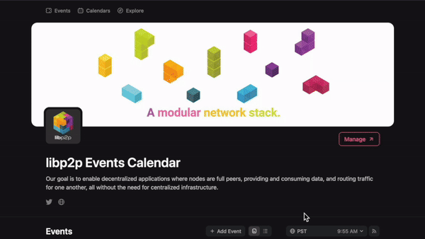

---
tags:
- libp2p
- meetings
title: Introduction to libp2p Community Meetings
description: An update on all of the libp2p community meetings happening now.
date: 2024-04-29
permalink: "/2024-04-29-libp2p-meetings/"
translationKey: ''
header_image: /social_banner.jpeg
author: Dave Grantham
---

**Table of Contents**

[[toc]]

## Introduction

The **lib**p2p Community is growing a little bit every day since the creation
of the **lib**p2p Foundation and the independence of the **lib**p2p Projectback
in January of 2024. Many new improvements have been made to the communication
and administration of the project across the infrastructure. One such
improvement was the centralization of the **lib**p2p Community Calendar to one
location: [lu.ma/**lib**p2p](https://lu.ma/**lib**p2p). This blog post covers all of
the current community meetings you will find on the calendar as well out
outline how you can organize your own and get it promoted alongside the other
**lib**p2p meetings.

### The Current Calendar 

This is the current community calendar embeded from lu.ma:

<iframe
  src="https://lu.ma/embed/calendar/cal-7CPAnJtz4A4aj2X/events?compact=true&lt=light"
  width="100%"
  height="700"
  frameborder="0"
  style="border: 1px solid #bfcbda88; border-radius: 4px;"
  allowfullscreen=""
  aria-hidden="false"
  tabindex="0"
></iframe>

I would like to invite you to add the **lib**p2p Community Calendar feed to
your calendar and plan to attend. The easiest way to do that is to go to the
main calendar and click on the calendar feed to subscribe.

### I'm Interested in a Meeting about X-**lib**p2p...How can I start it?

I'm glad you asked. The **lib**p2p Community operates on a "2 + you" rule for
meetings. If you and two other people would like to start a meeting, let me
know and I will help you organize it, list it on the **lib**p2p calendar,
announce it on our social media feeds and all of our chat channels. Meetings
focused on an implementation of **lib**p2p also get highlighted in the
quarterly **lib**p2p reports and in the libp2p Community Update portion of the
[EngRes The Gathering](https://lu.ma/engres-the-gathering-05-2024) monthly
meetings.

I know that I am personally interested in all implementations of **lib**p2p so
you really only need to find one other person and I will plan to attend so that
we can have 3 people show up. I strongly encourage anybody interested in having
a meeting to find me (@dhuseby) on any of our [chat rooms](https://libp2p.io)
and let me know so I can help get it organized.

## Current Meetings

### **lib**p2p Community Call

At the time of this writing, the next **lib**p2p Community Call will take place
on May 14th, 2024:

<iframe
  src="https://lu.ma/embed-checkout/evt-eSQrlgIiDnllaxX?lt=light"
  width="100%"
  height="450"
  frameborder="0"
  style="border: 1px solid #bfcbda88; border-radius: 4px;"
  allowfullscreen=""
  aria-hidden="false"
  tabindex="0"
></iframe>

The community call is our most well attended meeting where we cover community
related news and updates. It is a great meeting to ask questions in and to
announce your projects using **lib**p2p. This is where maintainers of multiple
implementations come to talk about upcoming releases, important bugs, and
security advisories. If you only want to attend one **lib**p2p meeting, this is
the best one to get updated on all things **lib**p2p.

### **lib**p2p Specification Meeting

The *very first* **lib**p2p Specification Meeting will take place on May 7th,
2024:

<iframe
  src="https://lu.ma/embed-checkout/evt-OOKaZePc1GtxemW?lt=light"
  width="100%"
  height="450"
  frameborder="0"
  style="border: 1px solid #bfcbda88; border-radius: 4px;"
  allowfullscreen=""
  aria-hidden="false"
  tabindex="0"
></iframe>

This meeting is brand new. The **lib**p2p project is actually a set of
specifications defining a modular set of peer-to-peer protocols needed to span
the entire internet with scalable peer-to-peer services. This meeting is
designed to bring together peer-to-peer researchers and maintainers of the
**lib**p2p specs so that open issues can be discussed, consensus built, and
solutions quickly landed. If you have ever thought, "this could be better if
only the specification said this..." then this is the meeting for you. This is
where interroperability begins in the **lib**p2p ecosystem.

### **lib**p2p Implementation Meetings

All are welcome at any **lib**p2p community meeting, especially the
implementation specific open maintainer calls. The following meetings are
organized to discuss technical details about the **lib**p2p implementations in
the specific languages. Currently we have standing meetings for go-**lib**p2p,
rust-**lib**p2p, js-**lib**p2p, and the newly revived py-**lib**p2p
implementations. However there are other **lib**p2p implementations in C++,
Swift, Nim, JVM (Java/Kotlin), Zig, and .Net.

#### go-**lib**p2p

<iframe
  src="https://lu.ma/embed-checkout/evt-BJSy8Ek2n5e2Eam?lt=light"
  width="100%"
  height="450"
  frameborder="0"
  style="border: 1px solid #bfcbda88; border-radius: 4px;"
  allowfullscreen=""
  aria-hidden="false"
  tabindex="0"
></iframe>

#### rust-**lib**p2p 

<iframe
  src="https://lu.ma/embed-checkout/evt-9PZBkmyi770ahfI?lt=light"
  width="100%"
  height="450"
  frameborder="0"
  style="border: 1px solid #bfcbda88; border-radius: 4px;"
  allowfullscreen=""
  aria-hidden="false"
  tabindex="0"
></iframe>

#### js-**lib**p2p 

<iframe
  src="https://lu.ma/embed-checkout/evt-3rilY5TVrJ0fjWd?lt=light"
  width="100%"
  height="450"
  frameborder="0"
  style="border: 1px solid #bfcbda88; border-radius: 4px;"
  allowfullscreen=""
  aria-hidden="false"
  tabindex="0"
></iframe>

#### py-**lib**p2p 

<iframe
  src="https://lu.ma/embed-checkout/evt-AC7PT7pXE6C5VNj?lt=light"
  width="100%"
  height="450"
  frameborder="0"
  style="border: 1px solid #bfcbda88; border-radius: 4px;"
  allowfullscreen=""
  aria-hidden="false"
  tabindex="0"
></iframe>

#### nim-**lib**p2p 

The Nim implementation of **lib**p2p is organized round the Vac community found
here: [https://forum.vac.dev](https://forum.vac.dev). If you are interested in
nim-**lib**p2p, I suggest you go join that community and get involved.

#### dotnet-**lib**p2p

The .Net implementation of **lib**p2p has a [Telegram
group](https://t.me/dotnet_libp2p) where the maintainers have technical
discussions on an ongoing basis.

## Conclusion

I really hope to see all of you at one of the upcoming **lib**p2p meetings.
They really are how we most efficiently coordinate our efforts. Without
dedicated supporters, this project will not survive. Come make some new
friends.

Cheers! 🍻
