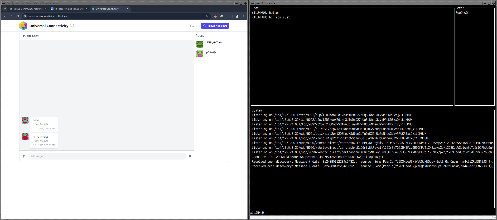

**Table of Contents**

[[toc]]

## March 2025 Newsletter 📰
Welcome to the March 2025 libp2p monthly newsletter! This month has been a
whirlwind of activity across the libp2p ecosystem, with 🚀 exciting releases,
📅 new meeting schedules, a 🚢 shiny new deployment, and an incredible volume
of work in the 🐍 py-libp2p project. Let’s dive into the highlights!

## Releases Galore 🚀 
March brought a wave of fresh releases across multiple implementations.
[go-libp2p 0.41.1][go-libp2p-release] rolled out with AutoNATv2 improvements,
while [nim-libp2p 1.9.0][nim-libp2p-release] introduced TLS certificate
enhancements. [py-libp2p 0.2.4][py-libp2p-release] landed with Windows
compatibility and more, and [cpp-libp2p 0.1.33][cpp-libp2p-release] and
[swift-libp2p 0.2.0][swift-libp2p-release] added their own polish to the mix.
Each release reflects the dedication of our contributors to making libp2p more
robust and versatile.

## New Meeting Schedules 📅
The [go-libp2p][go-libp2p-calendar] and [nim-libp2p][nim-libp2p-calendar]
project meetings have begun (again). They both have dedicated calendars for
their communities to sync up, brainstorm, and push the projects forward. These
meetings are a fantastic opportunity to get involved—check the calendars and
join the conversation!

## Universal Connectivity Gets a Boost 🚢
The [js-libp2p universal connectivity app][u-c-app] has a new home with a
triply redundant, unlimited-bandwidth deployment. Say goodbye to resource
constraints—this upgrade ensures seamless peer connectivity for all. It’s a
game-changer for developers and users alike, showcasing libp2p’s commitment to
reliable, scalable networking.

## py-libp2p’s Impressive Strides 🐍
The py-libp2p team has been on fire this month, delivering an astonishing
volume of work. From [Windows compatibility][py-libp2p-windows] to a completed
[identify protocol][py-libp2p-identify] and enhanced testing tools, the project
has seen over a dozen impactful PRs. Highlights include new examples for
[pubsub][py-libp2p-pubsub-example] and
[GossipSub][py-libp2p-gossipsub-example], plus a switch to `anyio` for better
async handling. All of this activity is quickly bringing py-libp2p up to full
compliance with the libp2p spec.

## Looking Ahead 🔭
Don’t forget—Virtual libp2p Day is just around the corner on April 4th! Join us
for a packed day of talks and networking ([register
here][virtual-libp2p-day-registration]). Good news: the pre-recorded talk
submission deadline has been extended to March 30th. Submit your proposals
[here][virtual-libp2p-day-proposals] and upload your talks
[here][virtual-libp2p-day-videos].

## Congratulations and Thanks 🎉
A massive congratulations to every contributor who made March a standout month
for libp2p! Your hard work, dedication, and collaboration are what makes this
project. Here’s to keeping the momentum going as we head into April!

Cheers! 🍻

[go-libp2p-release]: https://github.com/libp2p/go-libp2p/pull/3244
[nim-libp2p-release]: https://github.com/vacp2p/nim-libp2p/releases/tag/v1.9.0
[py-libp2p-release]: https://github.com/libp2p/py-libp2p/releases/tag/v0.2.4
[cpp-libp2p-release]: https://github.com/libp2p/cpp-libp2p/releases/tag/v0.1.33
[swift-libp2p-release]: https://github.com/swift-libp2p/swift-libp2p/releases/tag/0.2.0
[go-lib2p-calendar]: https://lu.ma/libp2p?tag=go
[nim-libp2p-calendar]: https://lu.ma/libp2p?tag=nim
[u-c-app]: https://universal-connectivity.js.bootstrap.farm/
[py-libp2p-windows]: https://github.com/libp2p/py-libp2p/pull/508
[py-libp2p-identify]: https://github.com/libp2p/py-libp2p/pull/506
[py-libp2p-pubsub-example]: https://github.com/libp2p/py-libp2p/pull/515
[py-libp2p-gossipsub-example]: https://github.com/libp2p/py-libp2p/pull/518
[virtual-libp2p-day-registration]: https://lu.ma/pauos8a7
[virtual-libp2p-day-proposals]: https://forms.gle/SsBP4671MSt3JNLt8
[virtual-libp2p-day-videos]: https://drive.google.com/drive/folders/1EuLWhhGGnwDYuYzkxMl5aHWOHLILuB-F
