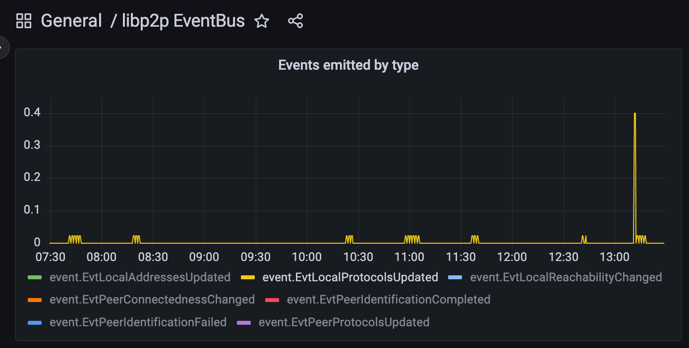

---
tags:
- metrics
- prometheus
- grafana
title: Metrics in go-libp2p
description:
date: 2023-06-29
permalink: "/2023-06-29-metrics-in-go-libp2p/"
author: Sukun Tarachandani
header_image: "/metrics-in-go-libp2p-header.png"
---

# Metrics in go-libp2p

## Introduction

libp2p is the core networking component for many projects such as IPFS, Filecoin, the Ethereum Beacon Chain, and more.
We as maintainers of go-libp2p, want to be able to observe the state of libp2p components and also enable our users to do the same in their production systems.
To that effect, we've been added instrumentation to collect metrics from various components over the last few months.
In fact, they've already helped us debug some nuanced go-libp2p issues and helped with the development of features (discussed in detail below).
Today, we'd like to share some of the choices we made, our learnings, and point you to resources that will help you monitor your deployments of go-libp2p.

## Why Prometheus?

We were first faced with the question of choosing a metrics collection and monitoring system. Among our choices were Prometheus, OpenCensus, and OpenTelemetry. The details of the discussion can be found [here](https://github.com/libp2p/go-libp2p/issues/1356).

We noticed that [OpenCensus creates a lot of allocations](https://github.com/libp2p/go-libp2p/issues/1955), which would lead to increased GC pressure. OpenTelemetry's metrics API is still unstable as of writing this blog. In contrast, Prometheus is performant (zero-alloc) and ubiquitous. This allows us to add metrics without sacrificing performance, even for frequently exercised code paths.
We also added ready-to-use Grafana dashboards, since Grafana is the preferred visualization tool for a lot of our users.

## How Users can enable Metrics

Metrics are enabled by default since go-libp2p [v0.26.0](https://github.com/libp2p/go-libp2p/releases/tag/v0.26.0). All you need to do is setup a Prometheus exporter for the collected metrics. 

```go

func main() {
        http.Handle("/metrics", promhttp.Handler())
	go func() {
		http.ListenAndServe(":2112", nil) // Any port is fine
	}()

	host, err := libp2p.New()
        // err handling
        ...
}
```
Now just point your Prometheus instance to scrape from `:2122/metrics`

By default, metrics are sent to the default Prometheus Registerer. To use a different Registerer from the default Prometheus registerer, use the option `libp2p.PrometheusRegisterer`. 

```go

func main() {
	reg := prometheus.NewRegistry()
        http.Handle("/metrics", promhttp.HandlerFor(reg, promhttp.HandlerOpts{}))
	go func() {
		http.ListenAndServe(":2112", nil) // Any port is fine
	}()

	host, err := libp2p.New(
                libp2p.PrometheusRegisterer(reg),
        )
        // err handling
        ...
}
```
 
### Discovering which Metrics are available

go-libp2p provides metrics and Grafana dashboards for all its major subsystems out of the box. You can check <https://github.com/libp2p/go-libp2p/tree/master/dashboards> for the Grafana dashboards available. Another great way to discover available metrics is to open Prometheus ui and type `libp2p_(libp2p-package-name)_` and find available metrics from autocomplete. For Ex: `libp2p_autonat_` gives you the list of all metrics exported from [AutoNAT](https://github.com/libp2p/specs/tree/master/autonat).

<div class="container" style="display:flex; column-gap:10px; justify-content: center; align-items: center;">
    <figure>
        
        <figcaption style="font-size:x-small;">
                EvtLocalAddressesUpdated
        </figcaption>
    </figure>
</div>

To see the dashboards in action check the [Metrics and Dashboards](https://github.com/libp2p/go-libp2p/tree/master/examples/metrics-and-dashboards) example in the go-libp2p repo. This example sets up a dummy libp2p app configured with a Prometheus and Grafana instance. You can check all the dashboards available at <http://localhost:3000/dashboards>.

### Local development and debugging setup

We've made it extremely easy to get started with metrics for local development. You can use the Docker setup provided in <https://github.com/libp2p/go-libp2p/tree/master/dashboards> to spin up a Grafana and Prometheus instance configured with all the available dashboards.

First add these lines to your code. This exposes a metrics collection endpoint at <http://localhost:5001/debug/metrics/prometheus>

```
import "github.com/prometheus/client_golang/prometheus/promhttp"

go func() {
    http.Handle("/debug/metrics/prometheus", promhttp.Handler())
    log.Fatal(http.ListenAndServe(":5001", nil))
}()
```

Now run `docker compose up` and access your application's metrics at <http://localhost:3000>


## How are Metrics useful?  

I'll share two cases where having metrics were extremely helpful for us in go-libp2p. One case deals with being able to debug a memory leak and one where adding two new metrics helped us with development of a new feature. 

### Debugging with Metrics

We were excited about adding metrics because it gave us the opportunity to observe exactly what was happening within the system. One of the first systems we added metrics to was the Event Bus. 
The event bus is used to pass event notifications between different libp2p components.
When we added event bus metrics, we were immediately able to see discrepancy between two of our metrics, `EvtLocalReachabilityChanged` and `EvtLocalAddressesUpdated`. You can see the details on the [GitHub issue](https://github.com/libp2p/go-libp2p/issues/2046)

<div class="container" style="display:flex; column-gap:10px; justify-content: center; align-items: center;">
    <figure>
        
        <figcaption style="font-size:x-small;">
                EvtLocalReachabilityChanged
        </figcaption>
    </figure>
</div>

<div class="container" style="display:flex; column-gap:10px; justify-content: center; align-items: center;">
    <figure>
        
        <figcaption style="font-size:x-small;">
                EvtLocalAddressesUpdated
        </figcaption>
    </figure>
</div>

Ideally when a node's reachability changes, its addresses should also change as it tries to obtain a [relay reservation](https://github.com/libp2p/specs/blob/master/relay/circuit-v2.md). This pointed us to an issue with [AutoNAT](https://github.com/libp2p/specs/tree/master/autonat). Upon debugging we realised that the we were emitting reachability changed events when the reachability had not changed and only the address to which the autonat dial succeeded had changed. 

The graph for event `EvtLocalProtocolsUpdated` pointed us to another problem. 

<div class="container" style="display:flex; column-gap:10px; justify-content: center; align-items: center;">
    <figure>
        
        <figcaption style="font-size:x-small;">
                EvtLocalProtocolsUpdated
        </figcaption>
    </figure>
</div>

A node's supported protocols shouldn't change if its reachability has not changed. Once we became aware of the issue, finding the root cause was simple enough. There was a problem with cleaning up the relay service used in relay manager. The details of the issue and the subsequent solution can be found [here](https://github.com/libp2p/go-libp2p/issues/2091)

### Development using Metrics

In go-libp2p [v0.28.0](https://github.com/libp2p/go-libp2p/releases/tag/v0.28.0) we introduced smart dialing. When connecting with a peer instead of dialing all the addresses of the peer in parallel, we now prioritise QUIC dials. This significantly reduces dial cancellations and reduces unnecessary load on the network. Check the smart dialing [PR](https://github.com/libp2p/go-libp2p/pull/2260) for more information on the algorithm used and the impact of smart dialing.

Not dialing all addresses in parallel increases latency for establishing a connection if the first dial doesn't succeed. We wanted to ensure that most of the connections succeeded with no additional latency. To help us better gauge the impact we added two metrics
1. Dial ranking delay. This metric tracks the latency in connection establishment introduced by the dial prioritisation logic. 
2. Dials per connection. This metric counts the number of addresses dialed before a connection was established with the peer. 

Dials per connection measured the benefit of introducing smart dialing mechanism, and dial ranking delay provided us with the assurance that the vast majority of dials had no adverse impact on latency. 

<div class="container" style="display:flex; column-gap:10px; justify-content: center; align-items: center;">
    <figure>
        
        <figcaption style="font-size:x-small;">
                Smart dialing metrics
        </figcaption>
    </figure>
</div>


## Resources

Check out our Grafana dashboards: <https://github.com/libp2p/go-libp2p/tree/master/dashboards>

To create custom dashboards, [Prometheus](https://prometheus.io/docs/prometheus/latest/querying/basics/) and [Grafana docs](https://grafana.com/docs/grafana/latest/panels-visualizations/) are great resources.


## Get Involved

- If you’d like to get involved and contribute to libp2p, you can reach out to us using these means: [https://libp2p.io/#community](https://libp2p.io/#community)
- If you’re a self-starter and want to start pushing code immediately, feel free to ping the maintainers in any of these help wanted/good first issues: [go-libp2p](https://github.com/libp2p/go-libp2p/issues?q=is%3Aopen+is%3Aissue+label%3A%22good+first+issue%22), [js-libp2p](https://github.com/libp2p/js-libp2p/issues?q=is%3Aopen+is%3Aissue+label%3A%22good+first+issue%22), and [rust-libp2p](https://github.com/libp2p/rust-libp2p/issues?q=is%3Aopen+is%3Aissue+label%3Agetting-started).
- If you want to work building p2p systems full-time, there are various teams hiring.  See [https://jobs.protocol.ai/jobs](https://jobs.protocol.ai/jobs) for opportunities across the [Protocol Labs Network](https://plnetwork.io/).

To learn more about libp2p generally, checkout:

- The [libp2p documentation portal](https://docs.libp2p.io/)
- The [libp2p connectivity website](https://connectivity.libp2p.io/)
- The [libp2p curriculum put together by the Protocol Labs Launchpad program](https://curriculum.pl-launchpad.io/curriculum/libp2p/introduction/)

You can reach out to us and stay tuned for our next event announcement by joining our [various communication channels](https://libp2p.io/#community), joining the [discussion forum](https://discuss.libp2p.io/), following us on [Twitter](https://twitter.com/libp2p), or saying hi in the #libp2p-implementers channel in the [Filecoin public Slack](http://filecoin.io/slack).