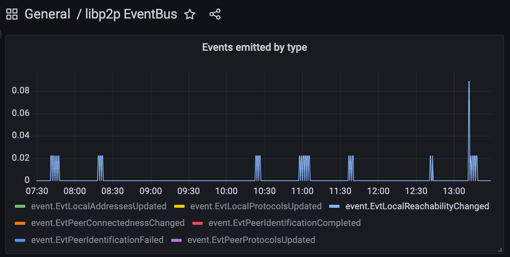

---
tags:
- metrics
- prometheus
title: Metrics in go-libp2p
description:
date: 2023-06-15
permalink: "/2023-06-15-metrics-in-go-libp2p/"
author: Sukun Tarachandani
---

# Metrics in go-libp2p

## Introduction

Libp2p is the core networking component for projects and so it is important to be able to observe the state of its components. To that effect, we've been adding metrics to the various components over the last few months. They've already helped us debug some issues and helped with the development of smart dialing. 

## Why Prometheus?

After deliberations between prometheus, opencensus, and opentelemetry, we decided to use prometheus. The details of the discussion can be found [here](https://github.com/libp2p/go-libp2p/issues/1356). To summarise, prometheus was performant and ubiquitious. This allowed us to add metrics without worrying too much about performance. We also ensured that tracking metrics didn't put too much pressure on the garbage collector, something that we'd found to be an [issue with opencensus](https://github.com/libp2p/go-libp2p/issues/1955).


## Enabling Metrics

Metrics have been enabled by default from go-libp2p v0.26.0. All you need to do is to setup a promtheus exporter for the collected metrics. 

```go

func main() {
        http.Handle("/metrics", promhttp.Handler())
	go func() {
		http.ListenAndServe(":2112", nil)
	}()

	host, err := libp2p.New()
        // err handling
        ...
}
```
Now all you have to do is to point your prometheus instance to scrape from `:2122/metrics`

By default, metrics are sent to the default prometheus Registerer. To use a different Registerer from the default prometheus registerer, use the option `libp2p.PrometheusRegisterer`. 

```go

func main() {
	reg := prometheus.NewRegistry()
        http.Handle("/metrics", promhttp.HandlerFor(reg, promhttp.HandlerOpts{}))
	go func() {
		http.ListenAndServe(":2112", nil)
	}()

	host, err := libp2p.New(
                libp2p.PrometheusRegisterer(reg),
        )
        // err handling
        ...
}
```

<!-- TODO: incorporate this PR: https://github.com/libp2p/go-libp2p/pull/2232 -->

## Discovering what metrics are available

go-libp2p provides metrics and grafana dashboards for all its major subsystems out of the box. You can check https://github.com/libp2p/go-libp2p/tree/master/dashboards for the grafana dashboards available. Another great way to discover available metrics is to open prometheus ui and type `libp2p_(libp2p-package-name)_` and find available metrics from autocomplete. For Ex: `libp2p_autonat_` gives you the list of all metrics exported from AutoNAT.

## How are metrics useful?  

I'll share two cases where having metrics were extremely helpful for us in go-libp2p. One case deals with being able to debug a memory leak and one where adding two new metrics helped us with development of a new feature. 

### Debugging with metrics

We were excited about adding metrics because it gave us the opportunity to observe exactly what was happening within the system. One of the first system we added metrics to was the Event Bus. When we added event bus metrics, we were immediately able to see discrepancy between two of our metrics, EvtLocalReachabilityChanged and EvtLocalAddressesUpdated.

<div class="container" style="display:flex; column-gap:10px; justify-content: center; align-items: center;">
    <figure>
        
        <figcaption style="font-size:x-small;">
                EvtLocalReachabilityChanged
        </figcaption>
    </figure>
</div>

<div class="container" style="display:flex; column-gap:10px; justify-content: center; align-items: center;">
    <figure>
        
        <figcaption style="font-size:x-small;">
                EvtLocalAddressesUpdated
        </figcaption>
    </figure>
</div>

Ideally when a node's reachability changes, the node's addresses should change as it tries to obtain a relay reservation. This pointed us to an issue with AutoNAT. Upon debugging we realised that the we were emitting reachability changed events when the reachability had not changed and only the address to which the autonat dial succeeded had changed. Another event EvtLocalProtocolsUpdated pointed us to another problem. 

<div class="container" style="display:flex; column-gap:10px; justify-content: center; align-items: center;">
    <figure>
        
        <figcaption style="font-size:x-small;">
                EvtLocalProtocolsUpdated
        </figcaption>
    </figure>
</div>

Node's supported protocols shouldn't change if node's reachability has not changed. Once aware of the issue, finding the root cause was simple enough. There was a problem with cleaning up the relay service used in relay manager.

You can see the details on the [github issue](https://github.com/libp2p/go-libp2p/issues/2046)

### Development using metrics

In go-libp2p v0.28.0 we introduced smart dialing. When connecting with a peer instead of dialing all the addresses of the peer in parallel, we now prioritise QUIC dials. This significantly reduces dial cancellations and reduces unnecessary load on the network. 

Not dialing all addresses in parallel does increase latency for establishing a connection when the first dial doesn't succeed. We wanted to ensure that most of the connections succeeded with no additional latency. To help us better gauge the impact we added two metrics
1. Dial ranking delay. This metric tracks the latency in connection establishment introduced by the dial prioritisation logic. 
2. Dials per connection. This metric counts the number of addresses dialed before a connection was established with the peer. 

Dials per connection measures the benefit of introducing smart dialing mechanism, and dial ranking delay provided us with the assurance that the vast majority of dials were unaffected. 

<div class="container" style="display:flex; column-gap:10px; justify-content: center; align-items: center;">
    <figure>
        
        <figcaption style="font-size:x-small;">
                Smart dialing metrics
        </figcaption>
    </figure>
</div>

The details can be seen on the smart-dialing [PR](https://github.com/libp2p/go-libp2p/pull/2260)


## Resources and How you can contribute

Check out our grafana dashboards: https://github.com/libp2p/go-libp2p/tree/master/dashboards

To create custom dashboards, the [prometheus](https://prometheus.io/docs/prometheus/latest/querying/basics/) and [grafana docs](https://grafana.com/docs/grafana/latest/panels-visualizations/) are great resources.

If you would like to contribute, please [connect with the libp2p maintainers](https://libp2p.io/#community)

