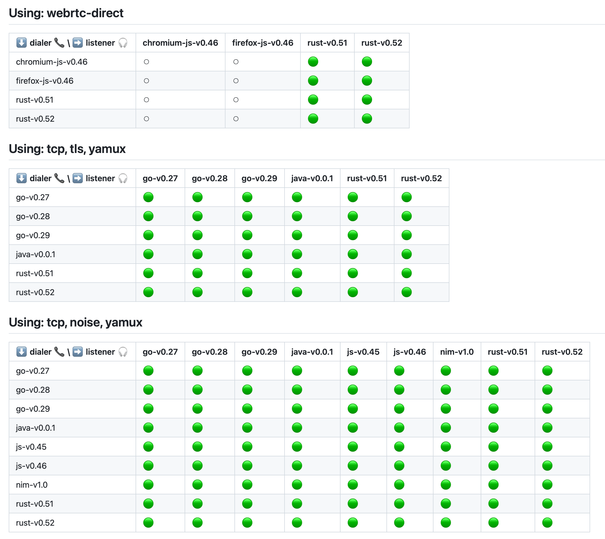

---
tags:
  - libp2p
title: Testing all the libp2ps
description: Basic interoperability tests for every libp2p implementation on all transport dimensions.
date: 2023-08-09
permalink: ''
translationKey: ''
header_image: /interop-testing.png
author: Marco Munizaga
---

# Background

There are many [implementations](https://libp2p.io/implementations/) of libp2p  with varying degrees of feature completeness. To name a few, there’s a Go, Rust, JS, Nim, Java, and Zig implementation. Each implementation has [transports](https://docs.libp2p.io/concepts/transports/overview/), [secure channels](https://docs.libp2p.io/concepts/secure-comm/overview/), and [muxers](https://docs.libp2p.io/concepts/multiplex/overview/) that they support. How do we make sure that each implementation can communicate with every other implementation? And how do we check that they can communicate over each supported combination (transport+encryption+muxer tuple)? In this post I’ll cover how we test every implementation on every strategy, on many versions, and a couple of challenges we ran into along the way. Finally, I’ll highlight some open problems that ***you*** can contribute to. Be warned, nothing in here is novel or particularly fancy. Just basic plumbing to check if two libp2p implementations can talk to each other.

Testing connectivity interoperability is as simple as starting up two libp2p nodes and having them [ping](https://github.com/libp2p/specs/blob/master/ping/ping.md) each other. The difficulty arises in how we make a reproducible environment for every implementation and connection strategy. The first attempt used [Testground](https://docs.testground.ai/master/#/). That attempt didn’t get too far for various reasons you can read about [here](https://github.com/libp2p/test-plans/issues/103), but, to summarize, Testground was too complicated and slow for what we wanted to do here – Start up two nodes and have them ping each other. The next attempt used Docker’s [compose](https://compose-spec.io) directly with some TypeScript to help generate the compose files. This was much easier to build, and I got a working setup in half a day.

# Problems to solve

Compose handles spinning up the test environment and putting the nodes on the same network, but there were still a couple of problems to solve: How do we define this test environment? How do we share the listener’s address to the dialer so that it knows who to dial? And how do we build each implementation?

We solved the first problem in perhaps an unconventional way, Sqlite. The problem of “Given these implementations that support these parameters, find all combinations of implementations and parameters that should be able to communicate with each other” is equivalent to a [Join operation](https://en.wikipedia.org/wiki/Relational_algebra#Joins_and_join-like_operators). We could have solved this by manually implementing a join with nested for loops, but, and this might be my database background peeking through, it’s a lot more straightforward to define this in a [simple query](https://github.com/libp2p/test-plans/blob/9caabc8d0d16016cd89995f8ca8cd131f824ca7a/multidim-interop/src/generator.ts#L59). To populate the Sqlite tables, we create an [In-Memory database](https://www.sqlite.org/inmemorydb.html) and load data be [iterating](https://github.com/libp2p/test-plans/blob/master/multidim-interop/src/generator.ts#L40-L50) over each version defined in [versions.ts](https://github.com/libp2p/test-plans/blob/master/multidim-interop/versions.ts).

The second problem we solved by using Redis as a synchronization point. The listener pushes its address to Redis (`RPUSH`), and the dialer blocks until it can read the address from Redis (`BLPOP`). The reason I chose this was because I liked how Testground used the database as a synchronization primitive, and wanted to keep that property. In retrospect, I don’t think we actually need Redis here and it adds some unnecessary complexity. We could have just as easily had the test runner read the address from the server’s stdout and feed it via stdin to the dialer.

Now we have a way of defining which implementations will be connected to each other and how they’ll interact, but we still haven’t defined the implementations. At a high level, the things we care about for building the implementations are:

1. Be reproducible for a given commit.
2. Caching is an optimization. Things should be fine without it.
3. If we have a cache hit, be fast.

The test runner accepts a version that defines information about what a certain released version of an implementation is capable of. We test against the latest version of each implementation as well as older versions. Here’s the [type definition](https://github.com/libp2p/test-plans/blob/master/multidim-interop/versions.ts#L4-L14) and an example:

```tsx
type Version = {
    id: string,
    containerImageID: string,
    transports: Array<(string | { name: string, onlyDial: boolean })>,
    secureChannels: string[],
    muxers: string[]
		// If defined, this will increase the timeout for tests using this version
    timeoutSecs?: number,
}

// example
{
    id: "go-v0.28.0",
    transports: ["tcp", "ws", "quic", "quic-v1", "webtransport"],
    secureChannels: ["tls", "noise"],
    muxers: ["mplex", "yamux"],
    containerImageID: "sha256:598fe4..."
}

// Example 2, here we are testing a new version of go-libp2p
{
    id: "go-v0.29.0",
    transports: ["tcp", "ws", "quic", "quic-v1", "webtransport"],
    secureChannels: ["tls", "noise"],
    muxers: ["mplex", "yamux"],
    containerImageID: "sha256:ead2d2..."
}
```

The whole file for every version and implementation can be found at `[multidim-interop/versions.ts](https://github.com/libp2p/test-plans/blob/master/multidim-interop/versions.ts)`. Every time a new libp2p version is released, we update this file. Right now it’s manual (and for go-libp2p it’s part of our [release checklist](https://github.com/libp2p/go-libp2p/blob/master/.github/ISSUE_TEMPLATE/release.md)).

Compose itself only references the provided container image ID. It’s up to each implementation to decide how it wants to build a containerized version of its node. Implementations define how to build themselves with a Makefile (example for [go-libp2p v0.28](https://github.com/libp2p/test-plans/blob/master/multidim-interop/impl/go/v0.28/Makefile)). These produce an `image.json` file that define the container image ID. The caching layer will cache these images by the SHA256 hash of their inputs (e.g. the Makefile) and the target architecture (x86 vs arm64). We store these cached images in S3, and the tool will try to load the cached images before building (see [caching](https://github.com/libp2p/test-plans/blob/master/multidim-interop/README.md#caching)). Forks and libp2p implementations have read access to this cache so they can benefit from faster builds.

This system supports testing browsers by having the node use [Playwright](https://playwright.dev) to spin up a browser. We test WebRTC by having the listener node also include a relay node to facilitate the WebRTC handshake. From the test system’s point of view this looks identical to a non-browser test.

# Coverage

Right now, the system tests 6 different libp2p implementations and runs about 1700 tests. The tests are also run on each PR in {Go, Rust, JS, Nim, and Zig}-libp2p. Are you working on a libp2p implementation and want to make sure you’re compatible? Checkout the [README.md](https://github.com/libp2p/test-plans/blob/master/multidim-interop/README.md) for the specifics on how to implement this test.



See the latest full run at: [https://github.com/libp2p/test-plans/actions/workflows/multidim-interop.yml?query=branch%3Amaster](https://github.com/libp2p/test-plans/actions/workflows/multidim-interop.yml?query=branch%3Amaster). The run is defined by this [GitHub action](https://github.com/libp2p/test-plans/blob/master/.github/actions/run-interop-ping-test/action.yml).

# Impact realized so far

The system has already helped catch a couple bugs such as:

- quic-go wrong cipher selection: [https://github.com/quic-go/quic-go/pull/4031](https://github.com/quic-go/quic-go/pull/4031)
- Interop failure with Firefox ←webrtc→ Firefox: [https://github.com/libp2p/js-libp2p-webrtc/pull/179](https://github.com/libp2p/js-libp2p-webrtc/pull/179).
- zig-libp2p expected the other side to always optimistically send the protocol id in its [multistream-select](https://github.com/libp2p/specs/tree/master/connections#multistream-select):  [https://github.com/MarcoPolo/zig-libp2p/pull/2](https://github.com/MarcoPolo/zig-libp2p/pull/2)
- Interop issue with Yamux with rust-libp2p ↔ js-libp2p: [https://github.com/libp2p/rust-yamux/pull/156](https://github.com/libp2p/rust-yamux/pull/156)
- Subtle dependency on identify to connect: [https://github.com/status-im/nim-libp2p/issues/924](https://github.com/status-im/nim-libp2p/issues/924)
- Wrong default Noise handshake pattern [https://github.com/libp2p/rust-libp2p/pull/2954](https://github.com/libp2p/rust-libp2p/pull/2954)

As well as helped validate some big code changes such as:

- Validate the new WebTransport transport for rust-libp2p in Wasm: [https://github.com/libp2p/rust-libp2p/commit/85a846a7dd5b54649114babde56dd7f2ec8e760b](https://github.com/libp2p/rust-libp2p/commit/85a846a7dd5b54649114babde56dd7f2ec8e760b)
- Validate the replacement WebSocket library in go-libp2p: [https://github.com/libp2p/go-libp2p/pull/1982](https://github.com/libp2p/go-libp2p/pull/1982)
    - And then validate the revert: [https://github.com/libp2p/go-libp2p/pull/2280](https://github.com/libp2p/go-libp2p/pull/2280)

# Next steps

There’s still a couple of improvements we could make here. The biggest one is [making this faster](https://github.com/libp2p/test-plans/issues/214). In CI, each test (starting docker compose until it exits) takes about 2s. It’s unclear why this takes so long. My hunch is that it’s not the actual test that takes a while (the handshake and ping time is around 50-300ms), but the cost to setup the cgroups, network namespaces, and other docker specific things. Running the simplest docker image of `hello-world` takes around 400ms on my machine (`time docker run --rm hello-world`). There must be something here we can optimize.

Besides those issues, there is a whole host of things to work on for testing interoperability besides basic connectivity such as adding [tests for mDNS](https://github.com/libp2p/test-plans/issues/179) and testing interoperability of libp2p protocols like:

- Autonat: [https://github.com/libp2p/test-plans/issues/124](https://github.com/libp2p/test-plans/issues/124)
- Circuit V2: [https://github.com/libp2p/test-plans/issues/116](https://github.com/libp2p/test-plans/issues/116)
- Identify: [https://github.com/libp2p/test-plans/issues/91](https://github.com/libp2p/test-plans/issues/91)
- Holepunching/DCUtR: [https://github.com/libp2p/test-plans/issues/126](https://github.com/libp2p/test-plans/issues/126)
- (and likely more to come that will be added to https://github.com/libp2p/test-plans/issues/64)

There are some [great first
issues](https://github.com/libp2p/test-plans/issues?q=is%3Aissue+is%3Aopen+label%3A%22good+first+issue%22),
and we’d welcome anyone to jump in to support support libp2p in its core tenet
of providing rock solid stability.
